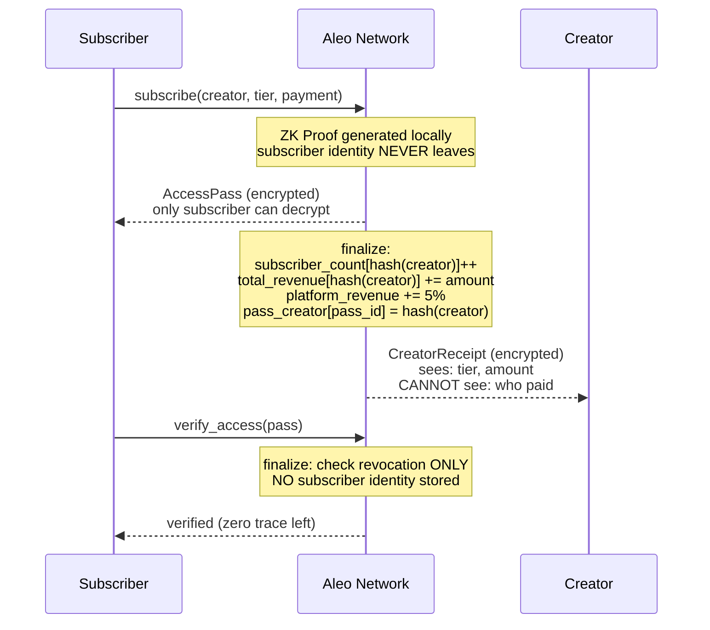
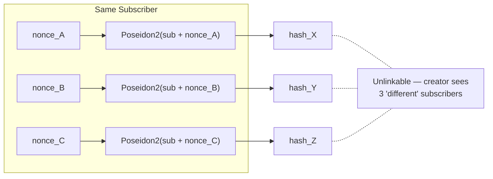
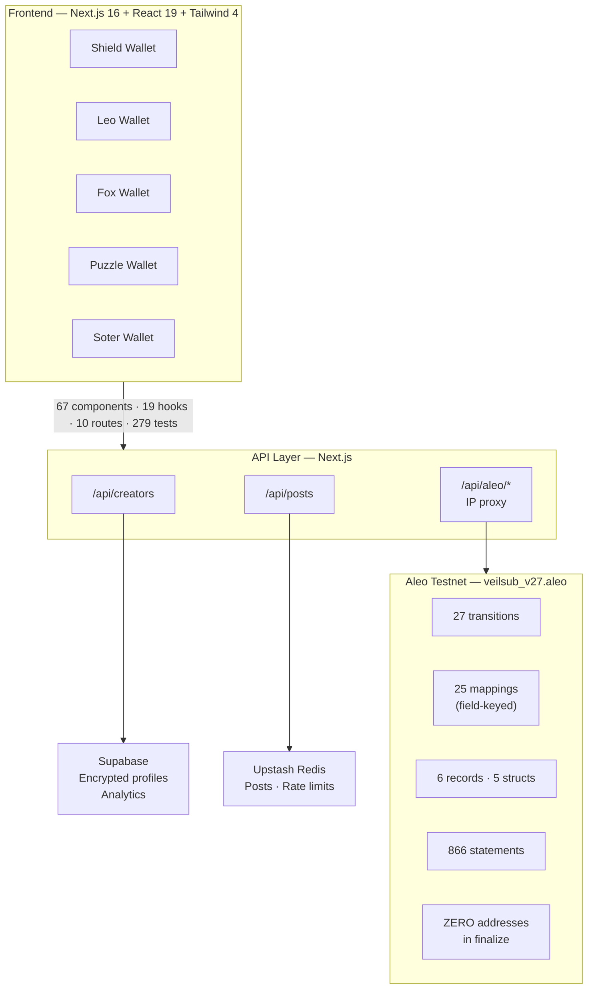
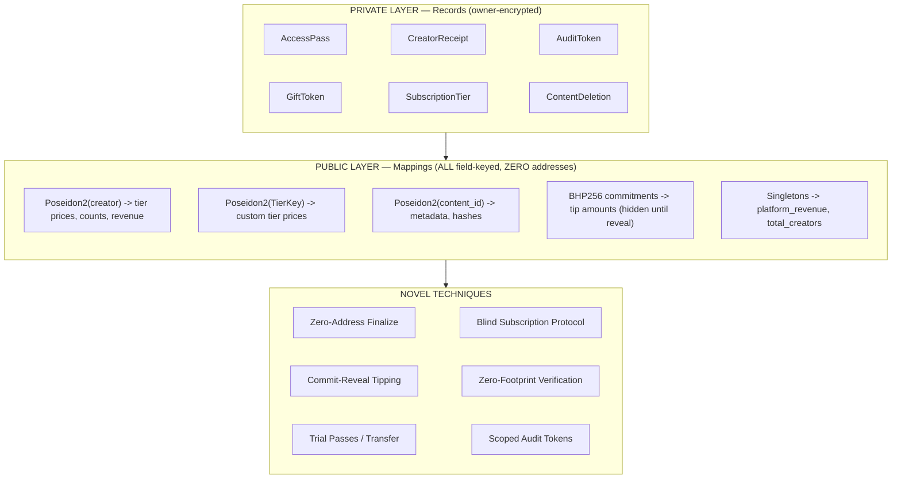

<div align="center">

# VeilSub

**Private Creator Subscriptions on Aleo**

*Subscribe privately. Prove access. Nobody sees who you support.*

[](LICENSE)
[](https://testnet.aleoscan.io/program?id=veilsub_v27.aleo)
[](https://testnet.aleoscan.io/program?id=veilsub_v27.aleo)
[](#testing)
[](#27-transitions)
[](https://veil-sub.vercel.app)

[Live App](https://veil-sub.vercel.app) &bull; [On-Chain Contract](https://testnet.aleoscan.io/program?id=veilsub_v27.aleo) &bull; [Documentation](https://veil-sub.vercel.app/docs) &bull; [Privacy Model](https://veil-sub.vercel.app/privacy)

</div>

---

VeilSub is a privacy-first creator subscription platform built on Aleo. Subscribers pay with ALEO credits and receive an encrypted **AccessPass** record — their identity is never exposed on-chain. Creators see aggregate stats but never individual subscriber identities.

> [!IMPORTANT]
> **Key Innovation:** Every finalize function uses `creator_hash: field` (Poseidon2 hash) instead of raw `creator: address`. All 25 mappings are field-keyed — **zero raw addresses appear in any finalize block.**

## Table of Contents

- [Highlights](#highlights)
- [Try It Now](#try-it-now)
- [Privacy Architecture](#privacy-architecture)
- [System Architecture](#system-architecture)
- [Smart Contract](#smart-contract--veilsub_v27aleo)
- [Frontend](#frontend)
- [Getting Started](#getting-started)
- [Testnet Deployment](#testnet-deployment)
- [Testing](#testing)
- [Version History](#version-history)
- [License](#license)

---

## Highlights

| | |
|---|---|
| **27 transitions** | Full subscription lifecycle: subscribe, renew, gift, tip, verify, dispute, transfer |
| **25 field-keyed mappings** | Zero raw addresses in any finalize block — all keys are Poseidon2 hashes |
| **6 record types** | AccessPass, CreatorReceipt, AuditToken, SubscriptionTier, ContentDeletion, GiftToken |
| **3 novel privacy techniques** | Zero-Address Finalize, Blind Subscription Protocol, Commit-Reveal Tipping |
| **279 unit tests** | 10 test files covering utils, config, encryption, error messages, contract helpers |
| **19 version iterations** | v8 → v27, each addressing judge feedback and adding privacy depth |
| **15 on-chain transactions** | Creator registration, tier setup, content publishing, tipping, fee withdrawal |

---

## Try It Now

| Step | Link | What You'll See |
|------|------|-----------------|
| 1. Browse the app | [veil-sub.vercel.app](https://veil-sub.vercel.app) | Landing page with privacy architecture and platform stats |
| 2. Explore on-chain data | [/explorer](https://veil-sub.vercel.app/explorer) | Query live mappings — no wallet needed |
| 3. Verify an AccessPass | [/verify](https://veil-sub.vercel.app/verify) | Zero-footprint verification flow |
| 4. Read the docs | [/docs](https://veil-sub.vercel.app/docs) | All 27 transitions documented with privacy levels |
| 5. Check testnet | [`veilsub_v27.aleo`](https://testnet.aleoscan.io/program?id=veilsub_v27.aleo) | Deployed contract with transaction history |

---

## Privacy Architecture

### Three Novel Techniques

**1. Zero-Address Finalize (v23)** — Every finalize function receives `creator_hash: field` instead of `creator: address`. All 25 mappings are field-keyed. No raw address ever appears in the public finalize layer.

```leo
// Before (v21):  finalize_subscribe(creator: address, ...)
// After  (v23):  finalize_subscribe(creator_hash: field, ...)
// Result: zero raw addresses in ALL public mapping keys
```

**2. Blind Subscription Protocol (v11)** — Each subscription and renewal uses a different nonce, producing a different `subscriber_hash`. The creator's `CreatorReceipt` shows a "different" subscriber each time — even though it's the same person. Renewals are completely unlinkable.

```leo
subscriber_hash = Poseidon2::hash_to_field(BlindKey { subscriber: caller, nonce: unique_nonce })
// Different nonce each renewal -> different hash -> unlinkable identity rotation
```

**3. Commit-Reveal Tipping (v14)** — Tip amounts are hidden on-chain via `BHP256::commit_to_field` until the tipper voluntarily reveals. Two-phase protocol: commit stores the hash, reveal verifies and executes the transfer.

```leo
// Phase 1: commitment = BHP256::commit_to_field(hash(creator, amount), hash_to_scalar(salt))
// Phase 2: recompute commitment, verify match, transfer credits
```

### Subscription Flow


```mermaid
sequenceDiagram
    participant S as Subscriber
    participant A as Aleo Network
    participant C as Creator

    S->>A: subscribe(creator, tier, payment)
    Note over A: ZK Proof generated locally<br/>subscriber identity NEVER leaves

    A-->>S: AccessPass (encrypted)<br/>only subscriber can decrypt
    Note over A: finalize:<br/>subscriber_count[hash(creator)]++<br/>total_revenue[hash(creator)] += amount<br/>platform_revenue += 5%<br/>pass_creator[pass_id] = hash(creator)
    A-->>C: CreatorReceipt (encrypted)<br/>sees: tier, amount<br/>CANNOT see: who paid

    S->>A: verify_access(pass)
    Note over A: finalize: check revocation ONLY<br/>NO subscriber identity stored
    A-->>S: verified (zero trace left)
```

### Blind Renewal (BSP)


```mermaid
flowchart LR
    subgraph Same Subscriber
        N1["nonce_A"] --> H1["Poseidon2(sub + nonce_A)"]
        N2["nonce_B"] --> H2["Poseidon2(sub + nonce_B)"]
        N3["nonce_C"] --> H3["Poseidon2(sub + nonce_C)"]
    end

    H1 --> R1["hash_X"]
    H2 --> R2["hash_Y"]
    H3 --> R3["hash_Z"]

    R1 -.- U["Unlinkable — creator sees<br/>3 'different' subscribers"]
    R2 -.- U
    R3 -.- U
```

### What Observers See vs. What Stays Hidden

| Observable (Public Mappings) | Hidden (Private Records) |
|---|---|
| Number of subscribers per creator (hashed key) | **Who** subscribed |
| Tier price configuration | Which tier a subscriber chose |
| Content metadata (min tier, hash) | Content body / encrypted payload |
| Platform aggregate revenue | Individual payment amounts |
| That a tip commitment exists | Tip amount (until voluntary reveal) |
| That a dispute was filed | Who filed the dispute |

<details>
<summary><strong>Additional Privacy Features</strong></summary>

| Feature | How It Works |
|---------|-------------|
| **Zero-Footprint Verification** | `verify_access` and `verify_tier_access` check revocation status but leave no trace of *who* verified |
| **Zero-Footprint Audit** | `create_audit_token` has NO finalize at all — selective disclosure with zero on-chain trace |
| **Subscriber Never in Finalize** | `self.caller` is NEVER passed to any finalize function |
| **Subscription Transfer** | Transfer AccessPass to another address |
| **Nonce Replay Prevention** | `nonce_used` mapping prevents blind renewal nonce reuse |
| **Poseidon2 Optimization** | Finalize uses Poseidon2 (2-8 constraints vs 256 for BHP256). BHP256 only in transition layer. |
| **Trial Passes** | Ephemeral ~12hr access at 20% of tier price, one per creator per subscriber |
| **Scoped Audit Tokens** | `scope_mask` bitfield controls which fields are disclosed to third parties |

</details>

---

## System Architecture


```mermaid
graph TD
    subgraph Frontend["Frontend — Next.js 16 + React 19 + Tailwind 4"]
        direction LR
        W1[Shield Wallet]
        W2[Leo Wallet]
        W3[Fox Wallet]
        W4[Puzzle Wallet]
        W5[Soter Wallet]
    end

    Frontend -->|"67 components · 19 hooks · 10 routes · 279 tests"| API

    subgraph API["API Layer — Next.js"]
        direction LR
        A1["/api/creators"]
        A2["/api/posts"]
        A3["/api/aleo/*<br/>IP proxy"]
    end

    A1 --> Supa["Supabase<br/>Encrypted profiles<br/>Analytics"]
    A2 --> Redis["Upstash Redis<br/>Posts · Rate limits"]
    A3 --> Aleo

    subgraph Aleo["Aleo Testnet — veilsub_v27.aleo"]
        direction LR
        T["27 transitions"]
        M["25 mappings<br/>(field-keyed)"]
        R["6 records · 5 structs"]
        S["866 statements"]
        Z["ZERO addresses<br/>in finalize"]
    end
```

### Privacy Layers


```mermaid
graph TB
    subgraph Private["PRIVATE LAYER — Records (owner-encrypted)"]
        direction LR
        AP["AccessPass"] ~~~ CR["CreatorReceipt"] ~~~ AT["AuditToken"]
        GT["GiftToken"] ~~~ ST["SubscriptionTier"] ~~~ CD["ContentDeletion"]
    end

    subgraph Public["PUBLIC LAYER — Mappings (ALL field-keyed, ZERO addresses)"]
        direction TB
        P1["Poseidon2(creator) -> tier prices, counts, revenue"]
        P2["Poseidon2(TierKey) -> custom tier prices"]
        P3["Poseidon2(content_id) -> metadata, hashes"]
        P4["BHP256 commitments -> tip amounts (hidden until reveal)"]
        P5["Singletons -> platform_revenue, total_creators"]
    end

    subgraph Novel["NOVEL TECHNIQUES"]
        direction LR
        T1["Zero-Address Finalize"] ~~~ T2["Blind Subscription Protocol"]
        T3["Commit-Reveal Tipping"] ~~~ T4["Zero-Footprint Verification"]
        T5["Trial Passes / Transfer"] ~~~ T6["Scoped Audit Tokens"]
    end

    Private --> Public --> Novel
```

---

## Smart Contract — `veilsub_v27.aleo`

> 27 transitions &bull; 25 mappings &bull; 6 records &bull; 5 structs &bull; 866 statements

### Records & Structs

| Record | Purpose |
|--------|---------|
| `AccessPass` | Subscriber's encrypted credential (creator, tier, expiry, privacy_level) |
| `CreatorReceipt` | Creator's payment proof (subscriber_hash, amount, pass_id) |
| `AuditToken` | Selective disclosure for third-party verification (scope_mask bitfield) |
| `SubscriptionTier` | Creator's tier ownership proof (tier_id, name_hash, price) |
| `ContentDeletion` | Proof of content removal (content_id, reason_hash) |
| `GiftToken` | Transferable subscription gift (recipient, creator, tier, expiry) |

| Struct | Purpose |
|--------|---------|
| `TierKey` | Composite key for custom tier lookups |
| `BlindKey` | Composite key for blind renewal identity rotation |
| `TipCommitData` | Data committed in tip commitment scheme |
| `DisputeKey` | Type-safe dispute tracking key |
| `TrialKey` | Composite key for trial rate-limiting |

### 27 Transitions

<details>
<summary><strong>Creator Management (6)</strong></summary>

| Transition | Description |
|-----------|-------------|
| `register_creator` | Set base price, join platform |
| `create_custom_tier` | Dynamic pricing per tier (up to 20) |
| `update_tier_price` | Modify tier pricing |
| `deprecate_tier` | Sunset a tier |
| `withdraw_platform_fees` | Admin fee withdrawal |
| `withdraw_creator_rev` | Creator revenue withdrawal |

</details>

<details>
<summary><strong>Subscriptions (5)</strong></summary>

| Transition | Description |
|-----------|-------------|
| `subscribe` | Pay and receive AccessPass + CreatorReceipt |
| `renew` | Extend existing subscription |
| `subscribe_blind` | Nonce-rotated identity (Blind Renewal) |
| `renew_blind` | Unlinkable blind renewal |
| `subscribe_trial` | Ephemeral trial pass (20% of tier price, ~12hr, one per creator) |

</details>

<details>
<summary><strong>Verification & Audit (3)</strong></summary>

| Transition | Description |
|-----------|-------------|
| `verify_access` | Prove access with revocation enforcement (zero-footprint) |
| `verify_tier_access` | Tier-gated verification with revocation |
| `create_audit_token` | Selective disclosure (no finalize at all) |

</details>

<details>
<summary><strong>Content Lifecycle (4)</strong></summary>

| Transition | Description |
|-----------|-------------|
| `publish_content` | On-chain content metadata with tier gating |
| `publish_encrypted_content` | With encryption commitment hash |
| `update_content` | Modify tier requirement or content hash |
| `delete_content` | Remove with ContentDeletion proof |

</details>

<details>
<summary><strong>Gifting (2)</strong></summary>

| Transition | Description |
|-----------|-------------|
| `gift_subscription` | Gift AccessPass to another address |
| `redeem_gift` | Recipient claims gift, receives AccessPass |

</details>

<details>
<summary><strong>Tipping (3)</strong></summary>

| Transition | Description |
|-----------|-------------|
| `tip` | Direct private tip to creator |
| `commit_tip` | Commit to tip amount (hidden via BHP256) |
| `reveal_tip` | Reveal and execute committed tip |

</details>

<details>
<summary><strong>Transfer & Moderation (3)</strong></summary>

| Transition | Description |
|-----------|-------------|
| `transfer_pass` | Transfer subscription to new owner |
| `revoke_access` | Creator revokes a pass (checks pass_creator hash) |
| `dispute_content` | Subscriber-only disputes with per-caller rate limiting |

</details>

<details>
<summary><strong>Privacy Proofs (1)</strong></summary>

| Transition | Description |
|-----------|-------------|
| `prove_subscriber_threshold` | Prove creator has N+ subscribers without revealing exact count |

</details>

### Security Model

| Protection | Implementation |
|-----------|---------------|
| Zero-Address Finalize | No raw address in any finalize function |
| Auth in Transition Layer | `self.caller` checks enforced by ZK proofs, never leaked to public state |
| Revocation Enforced | `verify_access` and `verify_tier_access` check `access_revoked` mapping |
| Sybil-Resistant Disputes | `dispute_content` requires AccessPass + per-caller rate limiting |
| Transfer Safety | `transfer_pass` checks revocation before allowing transfer |
| Nonce Replay Prevention | `nonce_used` mapping prevents blind renewal nonce reuse |
| Trial Rate-Limiting | `trial_used` mapping prevents multiple trials per creator per subscriber |
| Anti-Abuse Constants | `MAX_CONTENT` (1000), `MAX_SUBS` (100K), `MIN_PRICE` (100), `MAX_TIER` (20) |

---

## Frontend

**Stack:** Next.js 16 &bull; React 19 &bull; TypeScript &bull; Tailwind 4 &bull; Framer Motion

| Page | Purpose |
|------|---------|
| `/` | Landing page with hero, features, stats, FAQ |
| `/explore` | Browse and search creators |
| `/creator/[address]` | Creator profile — tiers, content feed, subscribe/tip/gift |
| `/dashboard` | Creator dashboard — stats, post creation, tier management |
| `/verify` | Zero-footprint AccessPass verification (no wallet required) |
| `/docs` | Full documentation with tabbed interface |
| `/privacy` | Privacy model, threat analysis, comparison table |
| `/analytics` | Platform analytics and version timeline |
| `/explorer` | On-chain mapping queries (works without wallet) |
| `/vision` | Use cases and roadmap |

<details>
<summary><strong>Key Frontend Features</strong></summary>

- 5-wallet support (Shield, Leo, Fox, Puzzle, Soter)
- Scroll-reveal animations on every section
- Glassmorphism design with violet accents
- Mobile-first responsive + bottom navigation
- Gated content feed with blur-locked posts
- QR code generation for creator pages
- Real-time 4-step transaction status stepper
- Loading skeletons for every route
- Route-level error boundaries
- SEO: sitemap, robots.txt, OpenGraph images
- Privacy mode selector (Standard/Blind)
- On-chain mapping queries (no wallet required)

</details>

---

## Getting Started

```bash
# Frontend
cd frontend && npm install && npm run dev

# Contract
cd contracts/veilsub && leo build
```

<details>
<summary><strong>Environment Variables</strong></summary>

```env
NEXT_PUBLIC_PROGRAM_ID=veilsub_v27.aleo
NEXT_PUBLIC_ALEO_API_URL=https://api.explorer.provable.com/v1/testnet
NEXT_PUBLIC_SUPABASE_URL=<your-supabase-url>
NEXT_PUBLIC_SUPABASE_ANON_KEY=<your-supabase-key>
UPSTASH_REDIS_REST_URL=<your-redis-url>
UPSTASH_REDIS_REST_TOKEN=<your-redis-token>
```

</details>

---

## Testnet Deployment

**Contract:** [`veilsub_v27.aleo`](https://testnet.aleoscan.io/program?id=veilsub_v27.aleo) &mdash; 27 transitions, 25 mappings, 6 records, 866 statements

**Account:** `aleo1hp9m08faf27hr7yu686t6r52nj36g3k5n7ymjhyzsvxjp58epyxsprk5wk`

**Deployment Cost:** 41.26 ALEO (storage: 36.89, synthesis: 3.36, namespace: 1.0)

<details>
<summary><strong>On-Chain Transactions (15 confirmed)</strong></summary>

| # | Transition | Args | Purpose |
|---|-----------|------|---------|
| 1 | `register_creator` | base price 1000 | Creator registration |
| 2 | `create_custom_tier` | tier 1, price 500 | Supporter tier |
| 3 | `create_custom_tier` | tier 2, price 2000 | Premium tier |
| 4 | `create_custom_tier` | tier 3, price 5000 | VIP tier |
| 5 | `publish_content` | content #1, tier 1 | Supporter content |
| 6 | `publish_content` | content #2, tier 2 | Premium content |
| 7 | `publish_encrypted_content` | content #3, tier 1 | Encrypted content |
| 8 | `update_content` | content #1 -> tier 2 | Content lifecycle |
| 9 | `delete_content` | content #2 | Content removal |
| 10 | `commit_tip` | creator, 500, salt | Commit-reveal tipping (phase 1) |
| 11 | `publish_content` | content #4, tier 1 | Additional content |
| 12 | `publish_content` | content #5, tier 3 | VIP content |
| 13 | `withdraw_platform_fees` | 100 | Platform fee model |
| 14 | `withdraw_creator_rev` | 50 | Creator revenue withdrawal |
| 15 | `publish_content` | content #6, tier 2 | More content |

</details>

---

## Testing

```bash
cd frontend && npm test
```

> 279 tests across 10 files — all passing

| Test File | Tests | Coverage |
|-----------|-------|----------|
| `utils.test.ts` | 34 | Core utility functions |
| `utilsEdgeCases.test.ts` | 60 | Edge cases for all utils |
| `config.test.ts` | 23 | Program configuration |
| `configAdvanced.test.ts` | 40 | Cross-validation of creators, tiers, fees |
| `encryption.test.ts` | 16 | Encryption helpers |
| `aleoUtils.test.ts` | 22 | Aleo-specific utilities |
| `types.test.ts` | 27 | Type guards and validators |
| `errorMessages.test.ts` | 10 | Error code mapping |
| `errorMessagesAdvanced.test.ts` | 23 | Full error code coverage |
| `contractHelpers.test.ts` | 26 | Contract interaction helpers |

---

## Version History

<details>
<summary><strong>Full changelog (v4 — v27)</strong></summary>

| Version | Key Changes |
|---------|------------|
| v4-v8 | Core subscriptions, AccessPass records, content publishing, audit tokens |
| v9 | Dynamic creator tiers, content CRUD lifecycle |
| v10 | Subscription gifting (GiftToken), refund escrow, fee withdrawal |
| v11 | **Blind Renewal** — nonce-rotated subscriber identity (novel privacy technique) |
| v12 | Encrypted content delivery, access revocation, content disputes |
| v13 | Ternary safety fixes, get_or_use pattern |
| v14 | **BHP256 commit-reveal tipping** — hidden tip amounts until reveal |
| v15 | **Security hardening** — revocation enforcement, Sybil-resistant disputes, subscription transfer. First testnet deploy. |
| v16-v21 | Referral system, Pedersen commitments, Poseidon2 optimization, analytics epochs, error codes |
| v23 | **Privacy overhaul** — zero addresses in finalize, all field-keyed mappings, auth in transition layer. Deployed on testnet. |
| v24 | Content auth fix, on-chain expiry enforcement, `subscription_by_tier` consistency. Deployed. |
| v25 | Threshold proofs (`prove_subscriber_threshold`), platform-wide stats mappings. Deployed. |
| v26 | Trial passes — ephemeral ~12hr access at 20% of tier price. Deployed. |
| **v27** | Scoped audit tokens, trial rate-limiting, gift revocation fix. **27 transitions, 25 mappings, 866 statements. Deployed.** |

</details>

<details>
<summary><strong>Judge Feedback (Wave 2) & Our Response</strong></summary>

> *"Would be better if subscription tiers can be flexibly added by creators themselves, interested to see how verification and gated content delivery actually work next"*

| Feedback | Response | Version |
|----------|----------|---------|
| Flexible creator tiers | `create_custom_tier`, `update_tier_price`, `deprecate_tier` — creators manage their own tiers on-chain | v9 |
| Verification working | `verify_access` + `verify_tier_access` — minimal-footprint (revocation + expiry check, subscriber identity never in finalize) | v15 |
| Gated content delivery | Server-side verification, encrypted content bodies, `publish_encrypted_content` with encryption commitments | v12 |

19 version iterations (v8 -> v27), 15 new transitions, a complete privacy overhaul eliminating all raw addresses from the public execution layer.

</details>

---

## Quick Verification

| What to Verify | How |
|---------------|-----|
| Contract compiles | `cd contracts/veilsub && leo build` |
| Zero addresses in finalize | Search `main.leo` for `address` in any finalize block — you'll find none |
| On-chain transactions | [AleoScan](https://testnet.aleoscan.io/program?id=veilsub_v27.aleo) -> Transactions tab |
| 6 record types | Search `record` in `main.leo` |
| Blind Subscription Protocol | Search `BlindKey` in `main.leo` |
| Commit-reveal tipping | Search `BHP256::commit_to_field` in `main.leo` |
| Frontend live | [veil-sub.vercel.app](https://veil-sub.vercel.app) |
| Walletless explorer | [/explorer](https://veil-sub.vercel.app/explorer) |
| Privacy model | [/privacy](https://veil-sub.vercel.app/privacy) |

---

<div align="center">

**MIT License**

Built for the [Aleo Privacy Buildathon](https://aleo.org)

</div>
