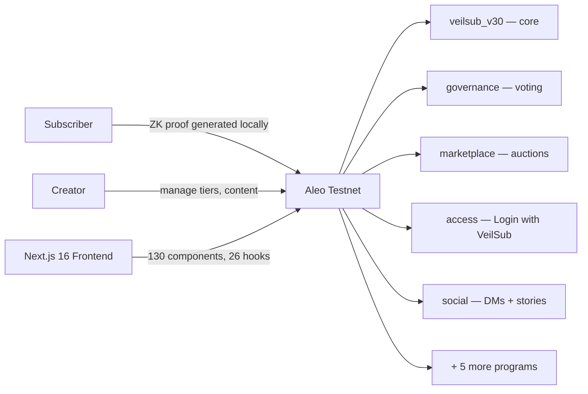

<div align="center">


### Subscribe privately. Support freely.

Privacy-first creator subscriptions on Aleo — your identity is mathematically impossible to expose.

[](https://veil-sub.vercel.app) |
[Watch 90s Demo](https://youtube.com/...) |
[AleoScan](https://testnet.aleoscan.io/program?id=veilsub_v30.aleo)

[](https://veil-sub.vercel.app)
[](https://testnet.aleoscan.io/program?id=veilsub_v30.aleo)
[](frontend/)
[](LICENSE)

</div>

---

## What is VeilSub?

VeilSub lets creators earn and subscribers pay — without either side knowing who the other is. Every subscription generates a zero-knowledge proof on the subscriber's device. The wallet address **never** touches public state. Renewals rotate identity through nonce-based Poseidon2 hashing, so even the same subscriber looks different every time. This is the **Blind Subscription Protocol (BSP)**: your identity isn't hidden behind encryption that could be broken — it is mathematically impossible to reconstruct.

10 programs are deployed on Aleo testnet. 88 transitions. 4,752 lines of Leo. All live.

---

## Features

### Subscribe
- **Private subscriptions** — pay with Credits, USDCx, or USAD stablecoins
- **Blind renewal** — each renewal rotates your on-chain identity via Poseidon2
- **Trial passes** — try any creator for ~50 minutes at 20% price, no commitment
- **Gift subscriptions** — gift access anonymously, recipient never knows who sent it
- **Commit-reveal tipping** — tip amounts hidden on-chain until you choose to reveal
- **Zero-footprint verification** — prove access without leaving any trace

### Create
- **Custom tiers** — up to 20 pricing tiers per creator, update or deprecate anytime
- **Rich text editor** — Tiptap with images, video embeds, full formatting
- **Encrypted content** — AES-256-GCM with per-creator keys, blur-locked previews
- **Revenue analytics** — real on-chain metrics with Pedersen-committed aggregates
- **Creator collaboration** — atomic revenue splits in the ZK circuit

### Earn
- **Triple token payments** — Credits + USDCx + USAD with per-token revenue tracking
- **Sealed-bid auctions** — BHP256 commit-reveal bidding for premium content
- **Private governance** — Pedersen-aggregated voting, direction never hits finalize
- **Anonymous reviews** — Poseidon2 nullifiers prevent double-review, identity never revealed
- **"Login with VeilSub"** — any Aleo app can gate resources behind VeilSub subscriptions

---

## Architecture


```mermaid
graph LR
    U[Subscriber] -->|ZK proof generated locally| A[Aleo Testnet]
    C[Creator] -->|manage tiers, content| A
    A --> V30[veilsub_v30 — core]
    A --> GOV[governance — voting]
    A --> MKT[marketplace — auctions]
    A --> ACC[access — Login with VeilSub]
    A --> SOC[social — DMs + stories]
    A --> MORE[+ 5 more programs]
    F[Next.js 16 Frontend] -->|130 components, 26 hooks| A
```

**10 deployed programs** on Aleo testnet — governance, marketplace, social, oracle, identity, collab, extras, access, hash utility, and the core contract. All verified live via `api.explorer.provable.com`.

---

## Privacy Model

| What the chain sees | What stays hidden |
|---|---|
| Subscriber count per creator (hashed key) | **Who** subscribed |
| That a tip commitment exists | Tip amount (until voluntary reveal) |
| Tier price configuration | Which tier a subscriber chose |
| Pedersen commitment of revenue | Individual payment amounts |

`self.caller` is **never** passed to any finalize function. All 30 mappings are field-keyed. Zero raw addresses in public state.

---

## Quick Start

```bash
git clone https://github.com/Pratiikpy/Veil-Sub.git
cd Veil-Sub/frontend && npm install && npm run dev
```

> **341 tests passing** — run `npm test` in `frontend/`.

For environment setup, contract compilation, and SDK usage, see the [Docs](https://veil-sub.vercel.app/docs).

---

## Tech Stack

| Layer | Technology |
|---|---|
| **Contract** | Leo (Aleo), 10 programs, 88 transitions |
| **Frontend** | Next.js 16, React 19, TypeScript, Tailwind 4 |
| **Storage** | Supabase (profiles, RLS), Upstash Redis (posts) |
| **Wallet** | Shield, Leo, Fox, Puzzle, Soter |
| **SDK** | `@veilsub/sdk` — typed interfaces for all transitions |
| **Hosting** | Vercel |

---

## Links

- **App** — [veil-sub.vercel.app](https://veil-sub.vercel.app)
- **GitHub** — [github.com/Pratiikpy/Veil-Sub](https://github.com/Pratiikpy/Veil-Sub)
- **SDK** — [`@veilsub/sdk`](sdk/)
- **AleoScan** — [veilsub_v30.aleo](https://testnet.aleoscan.io/program?id=veilsub_v30.aleo)
- **Docs** — [veil-sub.vercel.app/docs](https://veil-sub.vercel.app/docs)

---

<div align="center">

**Built with zero-knowledge proofs on [Aleo](https://aleo.org)**

MIT License

</div>
