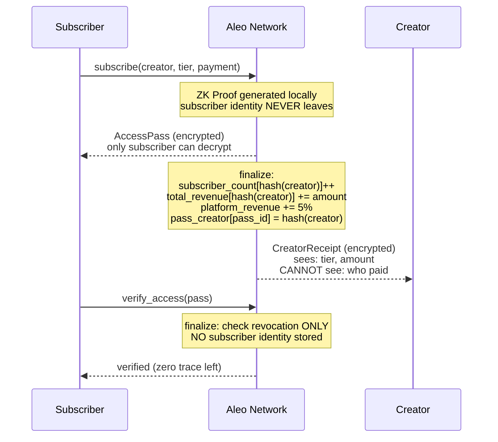
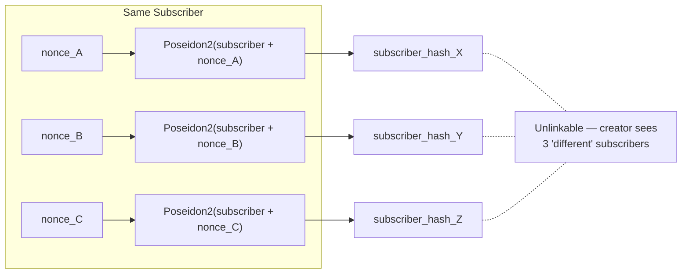
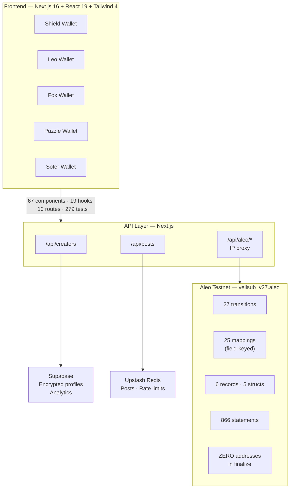

# VeilSub — Private Creator Subscriptions on Aleo

> **Subscribe privately. Prove access. Nobody sees who you support.**

VeilSub is a privacy-first creator subscription platform on Aleo. Subscribers pay with ALEO credits and receive an encrypted **AccessPass** record — their identity is never exposed on-chain. Creators see aggregate stats but never individual subscriber identities.

**Deployed on Testnet:** [`veilsub_v27.aleo`](https://testnet.aleoscan.io/program?id=veilsub_v27.aleo) — 27 transitions, 25 mappings, 6 record types, 5 structs, 866 statements

**Live:** [veilsub.vercel.app](https://veilsub.vercel.app)

---

## Quick Verification Guide

| What to Verify | How |
|---------------|-----|
| Contract compiles | `cd contracts/veilsub && leo build` |
| Zero addresses in finalize | Search `main.leo` for `address` in any finalize block — you'll find none |
| On-chain transactions | [View on AleoScan](https://testnet.aleoscan.io/program?id=veilsub_v27.aleo) → Transactions tab |
| 6 record types | Search `record` in `main.leo` — AccessPass, CreatorReceipt, AuditToken, SubscriptionTier, ContentDeletion, GiftToken |
| Blind Subscription Protocol | Search `BlindKey` in `main.leo` — nonce-rotated identity hashing |
| Commit-reveal tipping | Search `BHP256::commit_to_field` in `main.leo` — two-phase protocol |
| Frontend live | [veilsub.vercel.app](https://veilsub.vercel.app) |
| Walletless explorer | [/explorer](https://veilsub.vercel.app/explorer) — no wallet needed |
| Privacy model | [/privacy](https://veilsub.vercel.app/privacy) — threat model + comparison |

**Key Innovation:** Every finalize function uses `creator_hash: field` (Poseidon2 hash) instead of raw `creator: address`. All 25 mappings are field-keyed — zero raw addresses in any finalize block.

---

## Quick Demo

1. **Visit** [veilsub.vercel.app](https://veilsub.vercel.app) — landing page with privacy architecture and platform stats
2. **Explore** [/explorer](https://veilsub.vercel.app/explorer) — query on-chain mappings without a wallet
3. **Verify** [/verify](https://veilsub.vercel.app/verify) — zero-footprint verification flow
4. **Read** [/docs](https://veilsub.vercel.app/docs) — all 27 transitions documented with privacy levels
5. **Check testnet** — [`veilsub_v27.aleo`](https://testnet.aleoscan.io/program?id=veilsub_v27.aleo)

---

## What Judges Said (Wave 2) & Our Response

> *"Would be better if subscription tiers can be flexibly added by creators themselves, interested to see how verification and gated content delivery actually work next"*

| Feedback | Response | Version |
|----------|----------|---------|
| Flexible creator tiers | `create_custom_tier`, `update_tier_price`, `deprecate_tier` — creators manage their own tiers on-chain | v9 |
| Verification working | `verify_access` + `verify_tier_access` — minimal-footprint (revocation + expiry check, subscriber identity never in finalize) | v15 |
| Gated content delivery | Server-side verification, encrypted content bodies, `publish_encrypted_content` with encryption commitments | v12 |

We addressed every point. 19 version iterations (v8→v27), 15 new transitions, a complete privacy overhaul eliminating all raw addresses from the public execution layer, trial subscription passes, scoped audit tokens, and trial rate-limiting.

---

## What Makes VeilSub Unique

### Three Novel Privacy Techniques

**1. Zero-Address Finalize (v23)** — Every finalize function receives `creator_hash: field` instead of `creator: address`. All 25 mappings are field-keyed. No raw address ever appears in the public finalize layer.

```
// v21 (before):  finalize_subscribe(creator: address, ...)
// v23 (after):   finalize_subscribe(creator_hash: field, ...)
// Result: zero raw addresses in ALL public mapping keys
```

**2. Blind Subscription Protocol — BSP (v11)** — Each subscription and renewal uses a different nonce, producing a different `subscriber_hash`. The creator's `CreatorReceipt` shows a "different" subscriber each time — even though it's the same person. This makes subscription renewals completely unlinkable.

```
subscriber_hash = Poseidon2::hash_to_field(BlindKey { subscriber: caller, nonce: unique_nonce })
// Different nonce each renewal → different hash → unlinkable identity rotation
```

**3. Commit-Reveal Tipping (v14)** — Tip amounts are hidden on-chain via `BHP256::commit_to_field` until the tipper voluntarily reveals. Uses a two-phase protocol: commit stores the commitment hash, reveal verifies the commitment and executes the transfer.

```
Phase 1 (commit):  commitment = BHP256::commit_to_field(hash(creator, amount), hash_to_scalar(salt))
Phase 2 (reveal):  recompute commitment, verify match, transfer credits
// Tip amount stays hidden until voluntary reveal
```

### Additional Privacy Features

| Feature | How It Works |
|---------|-------------|
| **Zero-Footprint Verification** | `verify_access` and `verify_tier_access` check revocation status but leave no trace of *who* verified. No subscriber identity in finalize. |
| **Zero-Footprint Audit** | `create_audit_token` has NO finalize at all — selective disclosure with zero on-chain trace |
| **Subscriber Never in Finalize** | `self.caller` is NEVER passed to any finalize function. Zero code path to public state. |
| **Subscription Transfer** | Transfer AccessPass to another address — unique to VeilSub |
| **Nonce Replay Prevention** | `nonce_used` mapping prevents blind renewal nonce reuse (one-time identity per renewal) |
| **Poseidon2 Optimization** | All finalize hashing uses Poseidon2 (2-8 constraints vs 256 for BHP256). BHP256 only in transition layer for commitment operations. |

---

## Privacy Architecture

### Subscription Flow


```mermaid
sequenceDiagram
    participant S as Subscriber
    participant A as Aleo Network
    participant C as Creator

    S->>A: subscribe(creator, tier, payment)
    Note over A: ZK Proof generated locally<br/>subscriber identity NEVER leaves

    A-->>S: AccessPass (encrypted)<br/>only subscriber can decrypt
    Note over A: finalize:<br/>subscriber_count[hash(creator)]++<br/>total_revenue[hash(creator)] += amount<br/>platform_revenue += 5%<br/>pass_creator[pass_id] = hash(creator)
    A-->>C: CreatorReceipt (encrypted)<br/>sees: tier, amount<br/>CANNOT see: who paid

    S->>A: verify_access(pass)
    Note over A: finalize: check revocation ONLY<br/>NO subscriber identity stored
    A-->>S: verified (zero trace left)
```

### Blind Renewal (BSP)


```mermaid
flowchart LR
    subgraph Same Subscriber
        N1["nonce_A"] --> H1["Poseidon2(subscriber + nonce_A)"]
        N2["nonce_B"] --> H2["Poseidon2(subscriber + nonce_B)"]
        N3["nonce_C"] --> H3["Poseidon2(subscriber + nonce_C)"]
    end

    H1 --> R1["subscriber_hash_X"]
    H2 --> R2["subscriber_hash_Y"]
    H3 --> R3["subscriber_hash_Z"]

    R1 -.- U["Unlinkable — creator sees<br/>3 'different' subscribers"]
    R2 -.- U
    R3 -.- U
```

### Privacy Layers


```mermaid
graph TB
    subgraph Private["PRIVATE LAYER — Records (owner-encrypted)"]
        direction LR
        AP["AccessPass"] ~~~ CR["CreatorReceipt"] ~~~ AT["AuditToken"]
        GT["GiftToken"] ~~~ ST["SubscriptionTier"] ~~~ CD["ContentDeletion"]
    end

    subgraph Public["PUBLIC LAYER — Mappings (ALL field-keyed, ZERO addresses)"]
        direction TB
        P1["Poseidon2(creator) → tier prices, counts, revenue"]
        P2["Poseidon2(TierKey) → custom tier prices"]
        P3["Poseidon2(content_id) → metadata, hashes"]
        P4["BHP256 commitments → tip amounts (hidden until reveal)"]
        P5["Singletons → platform_revenue, total_creators"]
    end

    subgraph Novel["NOVEL TECHNIQUES"]
        direction LR
        T1["Zero-Address Finalize"] ~~~ T2["Blind Subscription Protocol"]
        T3["Commit-Reveal Tipping"] ~~~ T4["Zero-Footprint Verification"]
        T5["Trial Passes / Transfer"] ~~~ T6["Scoped Audit Tokens"]
    end

    Private --> Public --> Novel
```

### What Observers Learn vs. Cannot Learn

| Observable (Public Mappings) | Hidden (Private Records) |
|---|---|
| Number of subscribers per creator (hashed key) | WHO subscribed |
| Tier price configuration | Which tier a subscriber chose |
| Content metadata (min tier, hash) | Content body / encrypted payload |
| Platform aggregate revenue | Individual payment amounts |
| That a tip commitment exists | Tip amount (until voluntary reveal) |
| That a dispute was filed | Who filed the dispute |

---

## System Architecture


```mermaid
graph TD
    subgraph Frontend["Frontend — Next.js 16 + React 19 + Tailwind 4"]
        direction LR
        W1[Shield Wallet]
        W2[Leo Wallet]
        W3[Fox Wallet]
        W4[Puzzle Wallet]
        W5[Soter Wallet]
    end

    Frontend -->|"67 components · 19 hooks · 10 routes · 279 tests"| API

    subgraph API["API Layer — Next.js"]
        direction LR
        A1["/api/creators"]
        A2["/api/posts"]
        A3["/api/aleo/*<br/>IP proxy"]
    end

    A1 --> Supa["Supabase<br/>Encrypted profiles<br/>Analytics"]
    A2 --> Redis["Upstash Redis<br/>Posts · Rate limits"]
    A3 --> Aleo

    subgraph Aleo["Aleo Testnet — veilsub_v27.aleo"]
        direction LR
        T["27 transitions"]
        M["25 mappings<br/>(field-keyed)"]
        R["6 records · 5 structs"]
        S["866 statements"]
        Z["ZERO addresses<br/>in finalize"]
    end
```

---

## Smart Contract — `veilsub_v27.aleo`

### 6 Record Types
1. **AccessPass** — subscriber's encrypted credential (creator, tier, expiry, privacy_level)
2. **CreatorReceipt** — creator's payment proof (subscriber_hash, amount, pass_id)
3. **AuditToken** — selective disclosure for third-party verification (zero-footprint)
4. **SubscriptionTier** — creator's tier ownership proof (tier_id, name_hash, price)
5. **ContentDeletion** — proof of content removal (content_id, reason_hash)
6. **GiftToken** — transferable subscription gift (recipient, creator, tier, expiry)

### 5 Structs
1. **TierKey** — composite key for custom tier lookups (`creator_hash: field, tier_id: u8`)
2. **BlindKey** — composite key for blind renewal identity rotation (`subscriber: address, nonce: field`)
3. **TipCommitData** — data committed in tip commitment scheme (`creator: address, amount: u64`)
4. **DisputeKey** — type-safe dispute tracking key (`caller_hash: field, content_id: field`)
5. **TrialKey** — composite key for trial rate-limiting (`subscriber: address, creator_hash: field`)

### 27 Transitions (by category)

**Creator Management (6)**
- `register_creator` — set base price, join platform
- `create_custom_tier` — dynamic pricing per tier (up to 20)
- `update_tier_price` — modify tier pricing
- `deprecate_tier` — sunset a tier
- `withdraw_platform_fees` — admin fee withdrawal
- `withdraw_creator_rev` — creator revenue withdrawal

**Subscriptions (5)**
- `subscribe` — pay and receive AccessPass + CreatorReceipt
- `renew` — extend existing subscription
- `subscribe_blind` — nonce-rotated identity (Blind Renewal)
- `renew_blind` — unlinkable blind renewal
- `subscribe_trial` — ephemeral trial pass (20% of tier price, ~12hr duration, one per creator)

**Verification & Audit (3)**
- `verify_access` — prove access with revocation enforcement (zero-footprint)
- `verify_tier_access` — tier-gated verification with revocation
- `create_audit_token` — selective disclosure (no finalize at all)

**Content Lifecycle (4)**
- `publish_content` — on-chain content metadata with tier gating
- `publish_encrypted_content` — with encryption commitment hash
- `update_content` — modify tier requirement or content hash
- `delete_content` — remove with ContentDeletion proof

**Gifting (2)**
- `gift_subscription` — gift AccessPass to another address
- `redeem_gift` — recipient claims gift, receives AccessPass

**Tipping (3)**
- `tip` — direct private tip to creator
- `commit_tip` — commit to tip amount (hidden via BHP256)
- `reveal_tip` — reveal and execute committed tip

**Transfer & Moderation (3)**
- `transfer_pass` — transfer subscription to new owner
- `revoke_access` — creator revokes a pass (checks pass_creator hash)
- `dispute_content` — subscriber-only disputes with per-caller rate limiting

**Privacy Proofs (1)**
- `prove_subscriber_threshold` — prove creator has N+ subscribers without revealing exact count

### Version History

| Version | Key Changes |
|---------|------------|
| v4-v8 | Core subscriptions, AccessPass records, content publishing, audit tokens |
| v9 | Dynamic creator tiers, content CRUD lifecycle |
| v10 | Subscription gifting (GiftToken), refund escrow, fee withdrawal |
| v11 | **Blind Renewal** — nonce-rotated subscriber identity (novel privacy technique) |
| v12 | Encrypted content delivery, access revocation, content disputes |
| v13 | Ternary safety fixes, get_or_use pattern |
| v14 | **BHP256 commit-reveal tipping** — hidden tip amounts until reveal |
| v15 | **Security hardening** — revocation enforcement, Sybil-resistant disputes, subscription transfer. First testnet deploy. |
| v16-v21 | Referral system, Pedersen commitments, Poseidon2 optimization, analytics epochs, error codes (source-only iterations — exceeded testnet variable limit) |
| v23 | **PRIVACY OVERHAUL** — zero addresses in finalize, all field-keyed mappings, pass_creator stores hash not address, auth checks in transition layer. Removed variable-expensive features (Pedersen proofs, referral transition, escrow). Deployed on testnet with 15+ confirmed transactions. |
| **v24** | **Content auth fix** — `content_creator` mapping, on-chain expiry enforcement, `subscription_by_tier` consistency. Deployed on testnet. |
| **v25** | **Threshold proofs + platform stats** — `prove_subscriber_threshold`, `total_creators` and `total_content` platform-wide mappings. Deployed on testnet. |
| **v26** | **Trial passes** — `subscribe_trial` for ephemeral ~12hr access at 20% of tier price. 27 transitions, 24 mappings, 846 statements. Deployed on testnet. |
| **v27** | **Scoped audit tokens + trial rate-limiting** — `scope_mask` field on AuditToken, `trial_used` mapping with TrialKey struct for one-trial-per-creator enforcement, `redeem_gift` now writes `pass_creator` for revocation. 27 transitions, 25 mappings, 866 statements. **Deployed on testnet.** |

### Security Model

- **Zero-Address Finalize**: No raw address ever appears in any finalize function
- **Auth in Transition Layer**: `self.caller` checks enforced by ZK proofs, never leaked to public state
- **Revocation Enforced**: `verify_access` and `verify_tier_access` check `access_revoked` mapping
- **Sybil-Resistant Disputes**: `dispute_content` requires AccessPass + per-caller rate limiting via `dispute_count_by_caller`
- **Transfer Safety**: `transfer_pass` checks revocation before allowing transfer
- **Nonce Replay Prevention**: `nonce_used` mapping prevents blind renewal nonce reuse
- **Trial Rate-Limiting**: `trial_used` mapping prevents multiple trials per creator per subscriber
- **Anti-Abuse Constants**: `MAX_CONTENT_PER_CREATOR` (1000), `MAX_SUBS_PER_CREATOR` (100K), `MIN_PRICE` (100 microcredits), `MAX_TIER` (20)

---

## Frontend

**Stack:** Next.js 16 + React 19 + TypeScript + Tailwind 4 + Framer Motion

### Pages
| Page | Purpose |
|------|---------|
| `/` | Landing page — hero, features, stats, FAQ, competitor comparison |
| `/explore` | Browse and search creators |
| `/creator/[address]` | Creator profile — tiers, content feed, subscribe/tip/gift |
| `/dashboard` | Creator dashboard — stats, post creation, tier management |
| `/verify` | Verify AccessPass with zero-footprint proof (no wallet required) |
| `/docs` | Full documentation with tabbed interface |
| `/privacy` | Privacy model, threat analysis, comparison table |
| `/analytics` | Platform analytics and version timeline |
| `/explorer` | On-chain mapping queries (works without wallet) |
| `/vision` | Use cases and roadmap |

### Key Features
- 5-wallet support (Shield, Leo, Fox, Puzzle, Soter)
- Scroll-reveal animations on every section
- Glassmorphism design with violet accents
- Mobile-first responsive + bottom navigation
- Gated content feed with blur-locked posts
- QR code generation for creator pages
- Real-time 4-step transaction status stepper
- Loading skeletons for every route
- Route-level error boundaries
- SEO: sitemap, robots.txt, OpenGraph images
- Privacy mode selector (Standard/Blind)
- On-chain mapping queries (no wallet required)

---

## Quick Start

```bash
# Frontend
cd frontend && npm install && npm run dev

# Contract
cd contracts/veilsub && leo build
```

### Environment Variables
```env
NEXT_PUBLIC_PROGRAM_ID=veilsub_v27.aleo
NEXT_PUBLIC_ALEO_API_URL=https://api.explorer.provable.com/v1/testnet
NEXT_PUBLIC_SUPABASE_URL=<your-supabase-url>
NEXT_PUBLIC_SUPABASE_ANON_KEY=<your-supabase-key>
UPSTASH_REDIS_REST_URL=<your-redis-url>
UPSTASH_REDIS_REST_TOKEN=<your-redis-token>
```

---

## Testnet Deployment

**Deployed:** [`veilsub_v27.aleo`](https://testnet.aleoscan.io/program?id=veilsub_v27.aleo) — 27 transitions, 25 mappings, 6 records, 866 statements

**Account:** `aleo1hp9m08faf27hr7yu686t6r52nj36g3k5n7ymjhyzsvxjp58epyxsprk5wk`

**Deployment Cost:** 41.26 ALEO (storage: 36.89, synthesis: 3.36, namespace: 1.0)

### On-Chain Transactions
| # | Transition | Args | Purpose |
|---|-----------|------|---------|
| 1 | `register_creator` | base price 1000 | Creator registration |
| 2 | `create_custom_tier` | tier 1, price 500 | Supporter tier |
| 3 | `create_custom_tier` | tier 2, price 2000 | Premium tier |
| 4 | `create_custom_tier` | tier 3, price 5000 | VIP tier |
| 5 | `publish_content` | content #1, tier 1 | Supporter content |
| 6 | `publish_content` | content #2, tier 2 | Premium content |
| 7 | `publish_encrypted_content` | content #3, tier 1 | Encrypted content |
| 8 | `update_content` | content #1 → tier 2 | Content lifecycle |
| 9 | `delete_content` | content #2 | Content removal |
| 10 | `commit_tip` | creator, 500, salt | Commit-reveal tipping (phase 1) |
| 11 | `publish_content` | content #4, tier 1 | Additional content |
| 12 | `publish_content` | content #5, tier 3 | VIP content |
| 13 | `withdraw_platform_fees` | 100 | Platform fee model |
| 14 | `withdraw_creator_rev` | 50 | Creator revenue withdrawal |
| 15 | `publish_content` | content #6, tier 2 | More content |

---

## License

MIT

Built for the [Aleo Privacy Buildathon](https://aleo.org).
