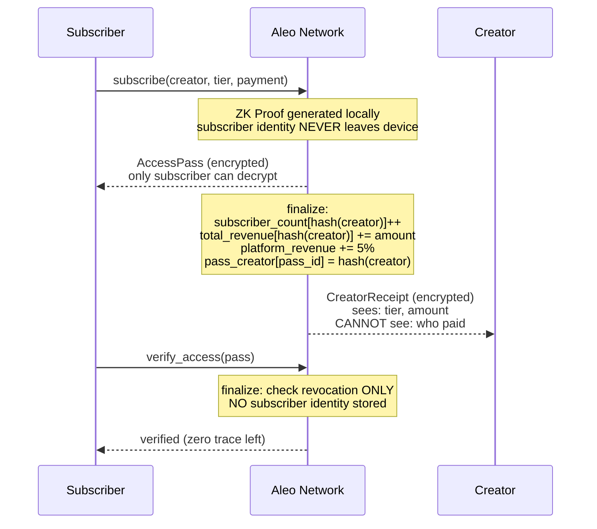
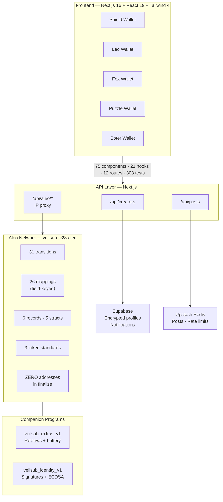

<div align="center">


### Private Subscriptions for Creators and Fans

*Pay privately. Prove access. Nobody sees who you support.*

[](https://veil-sub.vercel.app)
[](https://testnet.aleoscan.io/program?id=veilsub_v28.aleo)
[](#testing)
[](#smart-contract)
[](#triple-token-payments)
[](LICENSE)
[](https://veil-sub.vercel.app)
[](sdk/)

[Launch App](https://veil-sub.vercel.app) · [Explorer](https://veil-sub.vercel.app/explorer) · [Documentation](https://veil-sub.vercel.app/docs) · [Privacy Model](https://veil-sub.vercel.app/privacy)

</div>

---

## What is VeilSub?

VeilSub is a privacy-first creator subscription platform built on the Aleo blockchain. Creators publish content, set pricing tiers, and earn revenue — while subscribers pay and access content without ever revealing their identity on-chain. Every interaction is protected by zero-knowledge proofs: the subscriber's wallet address never appears in any public state.

VeilSub supports triple-token payments (Credits, USDCx, USAD), encrypted content delivery, rich text publishing, and a full creator economy with gifting, tipping, trials, and dispute resolution — all with privacy guarantees no Web2 platform can offer.

---

## Key Features

### For Subscribers

- **Private Subscriptions** — Pay with Credits, USDCx, or USAD. Your identity never hits public state.
- **Blind Renewal** — Each renewal rotates your on-chain identity via nonce-based Poseidon2 hashing. Even your creator cannot tell it is the same subscriber renewing.
- **Trial Passes** — Try any creator for ~12 hours at 20% of the tier price. No commitment.
- **Subscription Management** — View active passes, expiry countdowns, renewal status, and privacy mode from a single dashboard.
- **Gift Subscriptions** — Gift access to any creator. The recipient redeems without knowing who sent it.
- **Commit-Reveal Tipping** — Tip amounts stay hidden on-chain until you choose to reveal.
- **Privacy Dashboard** — Interactive "What does the chain see?" visualization showing exactly what is public vs. private.

### For Creators

- **Flexible Tiers** — Create up to 20 custom pricing tiers. Update or deprecate at any time.
- **Rich Text Editor** — Tiptap-based editor with images, video embeds, and formatting. Publish directly from the dashboard.
- **Video Content** — YouTube embeds and direct video support in posts.
- **Content Encryption** — AES-256-GCM encryption at rest with per-creator keys. On-chain encryption commitments prove integrity.
- **Revenue Analytics** — Real on-chain metrics: subscriber counts, revenue, tier breakdowns, sparkline trends.
- **Withdrawal UI** — Prominent earnings card with one-click withdraw for accumulated revenue.
- **Creator Onboarding Wizard** — 4-step guided setup: connect wallet, register, create tiers, publish first content.
- **Creator Discovery** — Searchable directory with categories, sort options, and a 3-column grid for maximum visibility.
- **Push Notifications** — Real-time alerts via Supabase Realtime for new subscribers, tips, and disputes.

### For Developers

- **@veilsub/sdk** — TypeScript SDK with full type coverage for all 31 transitions, 6 records, and 26 mappings.
- **Monitor Bot** — Autonomous daemon that polls on-chain state and fires notifications for subscription events.
- **Companion Programs** — `veilsub_extras_v1.aleo` (anonymous reviews with nullifiers + on-chain lottery) and `veilsub_identity_v1.aleo` (signature-verified authorship + cross-chain ECDSA identity).
- **On-Chain Explorer** — Query any mapping value without a wallet. Verify proofs independently.

---

## Triple Token Payments

VeilSub is the first Aleo subscription platform to support multiple token standards:

| Token | Use Case | Program |
|-------|----------|---------|
| **Credits** | Native ALEO payments (subscribe, renew, tip, gift) | `credits.aleo` |
| **USDCx** | Dollar-pegged subscriptions and tipping | `test_usdcx_stablecoin.aleo` |
| **USAD** | Alternative stablecoin subscriptions and tipping | `test_usad_stablecoin.aleo` |

Each token type has dedicated transitions with MerkleProof compliance verification. Revenue tracking is separated per token type via the `stablecoin_revenue` mapping.

---

## Try It

| Step | Link | What You'll See |
|------|------|-----------------|
| Browse the app | [veil-sub.vercel.app](https://veil-sub.vercel.app) | Landing page with privacy architecture, live stats, creator discovery |
| Explore creators | [/explore](https://veil-sub.vercel.app/explore) | Search, filter, and discover creators across categories |
| Query on-chain data | [/explorer](https://veil-sub.vercel.app/explorer) | Read live mapping values — no wallet needed |
| Verify an AccessPass | [/verify](https://veil-sub.vercel.app/verify) | Zero-footprint verification flow |
| Review the privacy model | [/privacy](https://veil-sub.vercel.app/privacy) | What the chain sees vs. what stays hidden |
| Read the docs | [/docs](https://veil-sub.vercel.app/docs) | All 31 transitions documented with privacy levels |

---

## Privacy Architecture

### Blind Subscription Protocol (BSP) — Three Layers

**Layer 1: Blind Identity Rotation** — Each subscription and renewal uses a unique nonce, producing a different `subscriber_hash` via Poseidon2. The creator's receipt shows a "different" subscriber each time — even though it is the same person. Renewals are completely unlinkable.

```leo
subscriber_hash = Poseidon2::hash_to_field(BlindKey { subscriber: caller, nonce: unique_nonce })
// Different nonce each time -> different hash -> unlinkable identity rotation
```

**Layer 2: Zero-Address Finalize** — Every finalize function receives `creator_hash: field` instead of `creator: address`. All 26 mappings are field-keyed. No raw address ever appears in any finalize block. `self.caller` is never passed to finalize.

```leo
// Before (v21):  finalize_subscribe(creator: address, ...)
// After  (v23):  finalize_subscribe(creator_hash: field, ...)
// Result: zero raw addresses in ALL public mapping keys
```

**Layer 3: Selective Disclosure** — Scoped audit tokens with `scope_mask` bitfields control exactly which fields a third-party verifier can see. Commit-reveal tipping hides amounts until voluntary reveal.

### What Observers See vs. What Stays Hidden

| Observable (Public Mappings) | Hidden (Private Records) |
|---|---|
| Number of subscribers per creator (hashed key) | **Who** subscribed |
| Tier price configuration | Which tier a subscriber chose |
| Content metadata (min tier, hash) | Content body / encrypted payload |
| Platform aggregate revenue | Individual payment amounts |
| That a tip commitment exists | Tip amount (until voluntary reveal) |
| That a dispute was filed | Who filed the dispute |
| Stablecoin revenue totals (by token type) | Which token a specific subscriber used |

### Subscription Flow


```mermaid
sequenceDiagram
    participant S as Subscriber
    participant A as Aleo Network
    participant C as Creator

    S->>A: subscribe(creator, tier, payment)
    Note over A: ZK Proof generated locally<br/>subscriber identity NEVER leaves device

    A-->>S: AccessPass (encrypted)<br/>only subscriber can decrypt
    Note over A: finalize:<br/>subscriber_count[hash(creator)]++<br/>total_revenue[hash(creator)] += amount<br/>platform_revenue += 5%<br/>pass_creator[pass_id] = hash(creator)
    A-->>C: CreatorReceipt (encrypted)<br/>sees: tier, amount<br/>CANNOT see: who paid

    S->>A: verify_access(pass)
    Note over A: finalize: check revocation ONLY<br/>NO subscriber identity stored
    A-->>S: verified (zero trace left)
```

<details>
<summary><strong>Additional Privacy Features</strong></summary>

| Feature | How It Works |
|---------|-------------|
| **Zero-Footprint Verification** | `verify_access` and `verify_tier_access` check revocation status but leave no trace of *who* verified |
| **Zero-Footprint Audit** | `create_audit_token` has NO finalize at all — selective disclosure with zero on-chain trace |
| **Subscriber Never in Finalize** | `self.caller` is NEVER passed to any finalize function |
| **Subscription Transfer** | Transfer AccessPass to another address privately |
| **Nonce Replay Prevention** | `nonce_used` mapping prevents blind renewal nonce reuse |
| **Trial Rate-Limiting** | `trial_used` mapping prevents multiple trials per creator per subscriber |
| **Scoped Audit Tokens** | `scope_mask` bitfield controls which fields are disclosed to third parties |
| **Poseidon2 Optimization** | Finalize uses Poseidon2 (2-8 constraints vs 256 for BHP256). BHP256 only in transition layer. |

</details>

---

## System Architecture


```mermaid
graph TD
    subgraph Frontend["Frontend — Next.js 16 + React 19 + Tailwind 4"]
        direction LR
        W1[Shield Wallet]
        W2[Leo Wallet]
        W3[Fox Wallet]
        W4[Puzzle Wallet]
        W5[Soter Wallet]
    end

    Frontend -->|"75 components · 21 hooks · 12 routes · 303 tests"| API

    subgraph API["API Layer — Next.js"]
        direction LR
        A1["/api/creators"]
        A2["/api/posts"]
        A3["/api/aleo/*<br/>IP proxy"]
    end

    A1 --> Supa["Supabase<br/>Encrypted profiles<br/>Notifications"]
    A2 --> Redis["Upstash Redis<br/>Posts · Rate limits"]
    A3 --> Aleo

    subgraph Aleo["Aleo Network — veilsub_v28.aleo"]
        direction LR
        T["31 transitions"]
        M["26 mappings<br/>(field-keyed)"]
        R["6 records · 5 structs"]
        S["3 token standards"]
        Z["ZERO addresses<br/>in finalize"]
    end

    subgraph Companion["Companion Programs"]
        direction LR
        E["veilsub_extras_v1<br/>Reviews + Lottery"]
        I["veilsub_identity_v1<br/>Signatures + ECDSA"]
    end

    Aleo --- Companion
```

---

## Smart Contract

> **Program:** `veilsub_v28.aleo` — 31 transitions · 26 mappings · 6 records · 5 structs · 3 token standards

### Records

| Record | Purpose |
|--------|---------|
| `AccessPass` | Subscriber's encrypted credential (creator, tier, expiry, privacy_level) |
| `CreatorReceipt` | Creator's payment proof (subscriber_hash, amount, pass_id) |
| `AuditToken` | Selective disclosure for third-party verification (scope_mask bitfield) |
| `SubscriptionTier` | Creator's tier ownership proof (tier_id, name_hash, price) |
| `ContentDeletion` | Proof of content removal (content_id, reason_hash) |
| `GiftToken` | Transferable subscription gift (recipient, creator, tier, expiry) |

### 31 Transitions

<details>
<summary><strong>Creator Management (6)</strong></summary>

| Transition | Description |
|-----------|-------------|
| `register_creator` | Set base price, join platform |
| `create_custom_tier` | Dynamic pricing per tier (up to 20) |
| `update_tier_price` | Modify tier pricing |
| `deprecate_tier` | Sunset a tier |
| `withdraw_platform_fees` | Admin fee withdrawal |
| `withdraw_creator_rev` | Creator revenue withdrawal |

</details>

<details>
<summary><strong>Subscriptions — Credits (5)</strong></summary>

| Transition | Description |
|-----------|-------------|
| `subscribe` | Pay with Credits, receive AccessPass + CreatorReceipt |
| `renew` | Extend existing subscription |
| `subscribe_blind` | Nonce-rotated identity (Blind Renewal) |
| `renew_blind` | Unlinkable blind renewal |
| `subscribe_trial` | Ephemeral trial pass (20% of tier price, ~12hr, one per creator) |

</details>

<details>
<summary><strong>Subscriptions — Stablecoins (4)</strong></summary>

| Transition | Description |
|-----------|-------------|
| `subscribe_usdcx` | Subscribe with USDCx stablecoin + MerkleProof compliance |
| `tip_usdcx` | Tip creator with USDCx |
| `subscribe_usad` | Subscribe with USAD stablecoin + MerkleProof compliance |
| `tip_usad` | Tip creator with USAD |

</details>

<details>
<summary><strong>Verification & Audit (3)</strong></summary>

| Transition | Description |
|-----------|-------------|
| `verify_access` | Prove access with revocation enforcement (zero-footprint) |
| `verify_tier_access` | Tier-gated verification with expiry check |
| `create_audit_token` | Selective disclosure (no finalize — zero on-chain trace) |

</details>

<details>
<summary><strong>Content Lifecycle (4)</strong></summary>

| Transition | Description |
|-----------|-------------|
| `publish_content` | On-chain content metadata with tier gating |
| `publish_encrypted_content` | With AES-256-GCM encryption commitment hash |
| `update_content` | Modify tier requirement or content hash |
| `delete_content` | Remove with ContentDeletion proof |

</details>

<details>
<summary><strong>Gifting & Transfer (3)</strong></summary>

| Transition | Description |
|-----------|-------------|
| `gift_subscription` | Gift AccessPass to another address |
| `redeem_gift` | Recipient claims gift, receives AccessPass |
| `transfer_pass` | Transfer subscription to new owner |

</details>

<details>
<summary><strong>Tipping (3)</strong></summary>

| Transition | Description |
|-----------|-------------|
| `tip` | Direct private tip to creator |
| `commit_tip` | Commit to tip amount (hidden via BHP256) |
| `reveal_tip` | Reveal and execute committed tip |

</details>

<details>
<summary><strong>Moderation & Proofs (3)</strong></summary>

| Transition | Description |
|-----------|-------------|
| `revoke_access` | Creator revokes a pass (checks pass_creator hash) |
| `dispute_content` | Subscriber-only disputes with per-caller rate limiting |
| `prove_subscriber_threshold` | Prove creator has N+ subscribers without revealing exact count |

</details>

### Security Model

| Protection | Implementation |
|-----------|---------------|
| Zero-Address Finalize | No raw address in any finalize function |
| Auth in Transition Layer | `self.caller` checks enforced by ZK proofs, never leaked to public state |
| Revocation Enforced | `verify_access` and `verify_tier_access` check `access_revoked` mapping |
| Sybil-Resistant Disputes | `dispute_content` requires AccessPass + per-caller rate limiting |
| Transfer Safety | `transfer_pass` checks revocation before allowing transfer |
| Nonce Replay Prevention | `nonce_used` mapping prevents blind renewal nonce reuse |
| Trial Rate-Limiting | `trial_used` mapping prevents multiple trials per creator per subscriber |
| Stablecoin Future Await | Stablecoin payment Futures are awaited before business logic executes |
| Anti-Abuse Constants | `MAX_CONTENT` (1000), `MAX_SUBS` (100K), `MIN_PRICE` (100), `MAX_TIER` (20) |

---

## Frontend

**Stack:** Next.js 16 · React 19 · TypeScript · Tailwind 4 · Framer Motion · Tiptap · Supabase · Upstash Redis

### Pages

| Route | Purpose |
|-------|---------|
| `/` | Landing — hero, feature showcase, live protocol stats, FAQ |
| `/explore` | Creator discovery — search, categories, sort, 3-column grid |
| `/creator/[address]` | Creator profile — tiers, content feed, subscribe/tip/gift |
| `/dashboard` | Creator dashboard — stats, rich text post creation, tier management, withdrawal |
| `/subscriptions` | Subscription manager — active passes, expiry countdowns, renewal |
| `/verify` | Zero-footprint AccessPass verification |
| `/privacy` | Privacy model, threat analysis, comparison table |
| `/privacy-dashboard` | Interactive "What does the chain see?" visualization |
| `/docs` | Full documentation with tabbed interface |
| `/analytics` | Platform analytics and version timeline |
| `/explorer` | On-chain mapping queries (works without wallet) |
| `/vision` | Use cases and roadmap |

### Highlights

- 5-wallet support (Shield, Leo, Fox, Puzzle, Soter)
- Rich text editor (Tiptap) with images, YouTube embeds, formatting
- AES-256-GCM content encryption with per-creator keys
- Real-time push notifications via Supabase Realtime
- 4-step creator onboarding wizard
- Privacy mode selector (Standard / Blind / Trial)
- Scroll-reveal animations, glassmorphism design, violet accents
- Mobile-first responsive layout with bottom navigation
- Gated content feed with blur-locked posts
- QR code generation for creator pages
- Real-time 4-step transaction status stepper
- Loading skeletons and route-level error boundaries
- SEO: sitemap, robots.txt, OpenGraph images
- IP-proxied API layer (`/api/aleo/*`) hides subscriber interest from third parties

---

## Developer Tools

### @veilsub/sdk

TypeScript SDK with full type coverage for building on VeilSub.

```bash
npm install @veilsub/sdk
```

```typescript
import type { AccessPass, CreatorStats, SubscribeParams } from '@veilsub/sdk'
import { MAPPING_NAMES, VeilSubError } from '@veilsub/sdk'
```

Includes typed interfaces for all 6 records, 5 structs, 26 mapping names, and transaction parameter builders for every transition.

### Monitor Bot

Autonomous daemon (`@veilsub/monitor-bot`) that continuously polls on-chain state and delivers notifications for subscription events — new subscribers, expirations, tips, disputes.

```bash
cd bot && npm run dev
```

### Companion Programs

| Program | Transitions | Mappings | Features |
|---------|------------|----------|----------|
| `veilsub_extras_v1.aleo` | Anonymous reviews with nullifiers, on-chain lottery with ChaCha randomness | Nullifier-based double-review prevention, verifiably random winner selection |
| `veilsub_identity_v1.aleo` | Signature-verified content authorship, cross-chain ECDSA identity (Ethereum), content timestamp notarization, identity proof via signature challenge |

---

## Getting Started

```bash
# Frontend
cd frontend && npm install && npm run dev

# Smart contract
cd contracts/veilsub && leo build

# SDK
cd sdk && npm install && npm run build

# Monitor bot
cd bot && npm install && npm run dev
```

<details>
<summary><strong>Environment Variables</strong></summary>

```env
NEXT_PUBLIC_PROGRAM_ID=veilsub_v28.aleo
NEXT_PUBLIC_ALEO_API_URL=https://api.explorer.provable.com/v1/testnet
NEXT_PUBLIC_SUPABASE_URL=<your-supabase-url>
NEXT_PUBLIC_SUPABASE_ANON_KEY=<your-supabase-key>
UPSTASH_REDIS_REST_URL=<your-redis-url>
UPSTASH_REDIS_REST_TOKEN=<your-redis-token>
```

</details>

---

## Testing

```bash
cd frontend && npm test
```

> **303 tests** across **11 files** — all passing

| Test File | Tests | Coverage |
|-----------|-------|----------|
| `utils.test.ts` | 34 | Core utility functions |
| `utilsEdgeCases.test.ts` | 60 | Edge cases for all utils |
| `config.test.ts` | 23 | Program configuration |
| `configAdvanced.test.ts` | 40 | Cross-validation of creators, tiers, fees |
| `contentEncryption.test.ts` | 24 | AES-256-GCM content encryption |
| `encryption.test.ts` | 16 | Encryption helpers |
| `aleoUtils.test.ts` | 22 | Aleo-specific utilities |
| `types.test.ts` | 27 | Type guards and validators |
| `errorMessages.test.ts` | 10 | Error code mapping |
| `errorMessagesAdvanced.test.ts` | 23 | Full error code coverage (119 codes) |
| `contractHelpers.test.ts` | 26 | Contract interaction helpers |

---

## Version History

<details>
<summary><strong>Full changelog (v4 — v28)</strong></summary>

| Version | Key Changes |
|---------|------------|
| v4-v8 | Core subscriptions, AccessPass records, content publishing, audit tokens |
| v9 | Dynamic creator tiers, content CRUD lifecycle |
| v10 | Subscription gifting (GiftToken), refund escrow, fee withdrawal |
| v11 | **Blind Renewal** — nonce-rotated subscriber identity (novel privacy technique) |
| v12 | Encrypted content delivery, access revocation, content disputes |
| v13 | Ternary safety fixes, get_or_use pattern |
| v14 | **BHP256 commit-reveal tipping** — hidden tip amounts until reveal |
| v15 | **Security hardening** — revocation enforcement, Sybil-resistant disputes, subscription transfer |
| v16-v21 | Referral system, Pedersen commitments, Poseidon2 optimization, analytics epochs |
| v23 | **Privacy overhaul** — zero addresses in finalize, all field-keyed mappings |
| v24 | Content auth fix, on-chain expiry enforcement |
| v25 | Threshold proofs (`prove_subscriber_threshold`), platform-wide stats mappings |
| v26 | Trial passes — ephemeral ~12hr access at 20% of tier price |
| v27 | Scoped audit tokens, trial rate-limiting, gift revocation fix |
| **v28** | **Triple token support (Credits + USDCx + USAD).** 4 new stablecoin transitions, MerkleProof compliance, dollar-denominated subscriptions. Companion programs: `veilsub_extras_v1` (reviews + lottery), `veilsub_identity_v1` (signatures + ECDSA). TypeScript SDK (`@veilsub/sdk`). Monitor bot. Content encryption (AES-256-GCM). Rich text editor. Privacy dashboard. Creator onboarding wizard. Push notifications. **31 transitions, 26 mappings, 3 token standards.** |

</details>

---

## Quick Verification

| What to Verify | How |
|---------------|-----|
| Contract compiles | `cd contracts/veilsub && leo build` |
| Zero addresses in finalize | Search `main.leo` for `address` in any finalize block — you will find none |
| On-chain state | [AleoScan](https://testnet.aleoscan.io/program?id=veilsub_v28.aleo) |
| 6 record types | Search `record` in `main.leo` |
| Blind Subscription Protocol | Search `BlindKey` in `main.leo` |
| Commit-reveal tipping | Search `BHP256::commit_to_field` in `main.leo` |
| Stablecoin transitions | Search `subscribe_usdcx` or `subscribe_usad` in `main.leo` |
| SDK types | `sdk/src/types.ts` — full typed interface for all transitions |
| Frontend live | [veil-sub.vercel.app](https://veil-sub.vercel.app) |
| Privacy dashboard | [/privacy-dashboard](https://veil-sub.vercel.app/privacy-dashboard) |

---

<div align="center">

**MIT License**

Built with zero-knowledge proofs on [Aleo](https://aleo.org)

</div>
