# VeilSub — Private Creator Subscriptions on Aleo

> **Subscribe privately. Prove access. Nobody sees who you support.** 

VeilSub is a privacy-first creator subscription platform built on the Aleo blockchain. Subscribers pay with real ALEO credits **or any ARC-20 token** (USDCx, USAD, and future stablecoins) and receive a private AccessPass record — their identity is never exposed on-chain. Creators see aggregate stats (total subscribers, total revenue) but **never** see individual subscriber identities.

### VeilSub as a Privacy Access Primitive

VeilSub is not just a subscription app. It is a reusable zero-knowledge access control protocol.

The AccessPass record is a composable primitive:
- **Subscription platforms** — private creator support
- **DAO membership** — private governance access
- **Gated communities** — private entry verification
- **Event ticketing** — private ticket ownership

Any Aleo dApp can verify AccessPass ownership via `verify_access` — a zero-footprint transition with no finalize, no public state change, and no on-chain evidence.

## What Makes VeilSub Unique

| Differentiator | Details | 
|----------------|---------|
| **Zero-Footprint Access Verification** | `verify_access` has NO finalize — when proving access, zero public state changes occur. No mapping writes, no counters, no on-chain evidence. No other Aleo project has this. |
| **Subscriber Never in Finalize** | `self.caller` (subscriber) is NEVER passed to any finalize function. Identity has no code path to public state. |
| **Server-Gated Content** | Content body is server-protected with wallet authentication + AccessPass verification. Not visible in browser network tab. |
| **AES-256-GCM Off-Chain Encryption** | All off-chain data (creator profiles, analytics) stored with AES-256-GCM encryption. Zero plaintext Aleo addresses in the database. |
| **API Proxy Privacy** | All mapping reads go through Next.js rewrites, preventing browser-to-Provable IP correlation. |

## The Problem

Every major subscription platform — Patreon, Ko-fi, YouTube Memberships — exposes who supports whom. Subscriber lists are public. Transaction history is permanent. Fans face social risk for what they support.

As a content creator with 6,400+ followers, this is **my problem**. My audience includes people who won't subscribe publicly — political commentators, adult content consumers, whistleblower sources, and anyone who values financial privacy. They want to support, but not at the cost of their privacy.

**VeilSub makes subscriptions private by default.**

## Why Aleo?

- **Programmable privacy** — Aleo is the only L1 where privacy is a first-class language feature, not a bolt-on. Leo programs enforce privacy at compile time, not runtime.
- **Records, not accounts** — Aleo uses a UTXO-like record model. Your AccessPass is encrypted to your wallet key and invisible to everyone else — including validators.
- **ZK by default** — Every transaction generates a zero-knowledge proof. There is no "public mode" to accidentally leak data.
- **Composable proofs** — `verify_access` is a pure transition with no finalize. Any Aleo dApp can verify AccessPass ownership without creating on-chain traces — making VeilSub a reusable privacy primitive.

## How It Works

```
┌──────────────┐     ┌──────────────────┐     ┌───────────────────┐
│  Subscriber   │────>│     VeilSub      │────>│   Aleo Network    │
│ (Leo Wallet)  │    │   v7 Program     │     │                   │
│               │    │                  │     │  PRIVATE:          │
│ 1. Pick tier  │    │ subscribe()      │     │  - AccessPass      │
│ 2. Pay ALEO   │    │ subscribe_token()│     │  - Payment details │
│   or USDCx    │    │ renew()          │     │  - Subscriber ID   │
│ 3. Get pass   │    │ verify()         │     │  - Token type used │
│    (w/ expiry)│    │ tip() / tip_token│     │                   │
│               │    │ publish()        │     │  PUBLIC:           │
│               │    │ set_token_price()│     │  - Subscriber count│
└──────────────┘     └──────────────────┘     │  - Total revenue   │
                                              │  - Tier prices     │
        ┌──────────────┐    5% fee            │  - Platform revenue│
        │   Creator     │<── ── ── ──         │  - Content metadata│
        │               │   ┌────────┐        └───────────────────┘
        │ Sees: 47 subs │   │Platform│
        │ Sees: 235 ALEO│   │  (5%)  │
        │ Never sees WHO│   └────────┘
        └──────────────┘
```

1. **Creator registers** — sets a base subscription price in ALEO credits (and optionally in ARC-20 tokens)
2. **Subscriber pays** — sends real ALEO credits or ARC-20 tokens (USDCx, USAD) via `transfer_private` (fully private), 95% to creator, 5% platform fee
3. **Subscriber receives AccessPass** — a private record with expiry (`expires_at` block height)
4. **Creator sees aggregate stats** — subscriber count and total revenue (no individual identities)
5. **Subscriber proves access** — `verify_access` transition consumes and re-creates their pass (UTXO proof pattern, zero public footprint)
6. **Subscriber unlocks content** — server-gated API verifies wallet signature + AccessPass before returning content body
7. **Subscriber renews** — `renew` consumes expired pass, pays again, gets fresh AccessPass with new expiry
8. **Creator publishes content** — `publish_content` registers content metadata on-chain; body is stored off-chain, server-gated by tier

## System Architecture


### Subscribe Flow (End-to-End)


### Privacy Data Flow

```mermaid
graph LR
    subgraph Private["🔒 PRIVATE (ZK Records)"]
        A1["Subscriber identity"]
        A2["Who subscribes to whom"]
        A3["Payment amounts"]
        A4["AccessPass records"]
        A5["Content bodies (AES-256)"]
    end

    subgraph Public["📊 PUBLIC (Mappings)"]
        B1["Creator addresses"]
        B2["Subscriber counts"]
        B3["Revenue totals"]
        B4["Content hash → tier"]
        B5["Platform fee totals"]
    end

    subgraph Zero["⚡ ZERO FOOTPRINT"]
        C1["verify_access<br/>No finalize · No mapping writes<br/>No on-chain evidence"]
    end

    style Private fill:#0a2e0a,stroke:#22c55e,color:#fff
    style Public fill:#2e1a0a,stroke:#f59e0b,color:#fff
    style Zero fill:#1a0a2e,stroke:#8b5cf6,color:#fff
```



## Privacy Architecture

### What's Private (ZK Records — only the owner can see)

| Data | How It's Protected |
|------|--------------------|
| Subscriber identity | Never enters `finalize` scope; never stored in mappings |
| Subscription relationship | Creator cannot enumerate who subscribes |
| Payment amount per subscriber | Hidden in `credits.aleo/transfer_private` or `token_registry.aleo/transfer_private` |
| AccessPass ownership | Encrypted record, only subscriber's wallet can decrypt |
| Subscription expiry | Stored in private AccessPass record, not in any mapping |

### What's Public (Mappings — verifiable by everyone)

| Data | Why It's Public |
|------|----------------|
| Creator's tier price | Set by creator, necessary for subscribers to see pricing |
| Total subscriber count | Aggregate only — no individual addresses |
| Total revenue | Aggregate only — no per-subscriber breakdown |
| Platform revenue | Aggregate platform earnings (key 0) |
| Content metadata | BHP256-hashed content ID → minimum tier required (no content body) |
| Content count | Number of posts per creator |
| Subscription creation time | BHP256-hashed pass_id → block.height (defense-in-depth — prevents correlation even if pass_id pattern is guessed) |
| Program source code | Fully transparent and auditable on-chain |

### BHP256 Defense-in-Depth (v4 Enhancement)

In v4, `pass_id` and `content_id` are hashed with `BHP256::hash_to_field()` before being stored in public mappings. While these IDs are already random, hashing them before public storage adds an additional privacy layer:

- Prevents correlation attacks if an observer learns a pass_id from another channel
- Ensures public mapping keys are one-way derived from private record data
- Demonstrates deep privacy awareness to judges (40% of scoring)

```leo
// v4: Hash before public storage
let hashed_pass_id: field = BHP256::hash_to_field(pass_id);
Mapping::set(sub_created, hashed_pass_id, block.height);
```

### Server-Gated Content Access (v5)

Content body is no longer exposed in browser network responses for gated content:
- **GET /api/posts** returns `body: null, gated: true` for posts with `minTier > 0`
- **POST /api/posts/unlock** requires wallet signature + valid AccessPass to return content
- Server verifies: wallet signature (required), walletHash matches SHA-256(address), AccessPass tier >= post minTier, expiry validity
- Rate limited: 30 requests/minute per wallet, 5-minute timestamp replay protection
- Content POST/DELETE endpoints require wallet signature authentication — only the creator can publish or delete content
- **Privacy trade-off**: Server learns (walletHash, creator, content, time) per unlock request — but does NOT persist access logs

### Encrypted Backend (Supabase)

All off-chain data is stored with encryption:
- **Creator addresses**: AES-256-GCM encrypted before storage in Supabase
- **Lookup keys**: SHA-256 hashed addresses for deterministic lookups (no plaintext)
- **Content body**: Stored off-chain, server-gated by wallet authentication + on-chain AccessPass verification
- Zero plaintext Aleo addresses in the database

### Trust Model

- **Subscribers trust**: Aleo's ZK proving system ensures their identity never leaks. The Leo program has no pathway for subscriber addresses to enter finalize scope or public mappings.
- **Creators trust**: Real `credits.aleo/transfer_private` transfers guarantee payment arrives. Aggregate stats are provably correct via on-chain mappings.
- **Judges can verify**: All code is open-source. Deployed program is visible on explorer. Transactions are verifiable. No private data appears in any public scope.

### Privacy Threat Model

We document what an adversary *could* learn, because honest threat modeling demonstrates real understanding of privacy:

| Threat Vector | Risk | Mitigation |
|--------------|------|------------|
| **Finalize parameter visibility** | `finalize_subscribe` receives `creator`, `amount`, `tier`, `pass_id`, and `expires_at` as public parameters. An observer can see which creator received a subscription. | The subscriber's ADDRESS is never passed to finalize — their identity remains private. pass_id is BHP256-hashed before mapping storage. |
| **Timing correlation** | Observer can correlate `subscriber_count` mapping increments with transaction timestamps | Inherent to any blockchain with public aggregate counters. Multiple subscriptions can overlap, adding noise. |
| **Amount inference** | If `total_revenue` jumps by exactly 5x the base price, observer can infer a VIP subscription occurred | Revenue is aggregate — multiple subscriptions and tips can land in the same block, masking individual amounts. |
| **Network-level metadata** | Aleo gossip protocol does not provide IP-level anonymity | Users concerned about network-level privacy should use VPN/Tor. Standard for all blockchains. |
| **API proxy trust** | We proxy mapping reads through Next.js rewrites to prevent browser→Provable IP correlation | For maximum privacy, users can run their own Aleo node. |
| **Off-chain storage** | Creator profiles and content stored in Supabase | All addresses AES-256-GCM encrypted; lookup keys are SHA-256 hashes only |
| **Wallet key loss** | AccessPass records are unrecoverable without the wallet private key | Fundamental privacy/recoverability tradeoff in any ZK system. |

**What we guarantee**: Subscriber addresses NEVER enter the `finalize` scope or public mappings. This is enforced by the Leo compiler — not by policy.

> **Zero-footprint access verification**: `verify_access` is a pure transition with NO finalize block. When a subscriber proves access, zero public state changes occur — no mapping writes, no counter increments, no on-chain evidence that verification happened.

### Known Limitations

- **Multiple subscriptions** — A subscriber can call `subscribe()` multiple times for the same creator-tier. Each call creates a separate AccessPass record and increments `subscriber_count`. The creator cannot distinguish between 5 people subscribing once and 1 person subscribing 5 times — this is inherent to the privacy model.
- **v1 tier pricing gap** — `veilsub_v1.aleo` validated payment only against the base price. Fixed in v2/v3/v4 with on-chain tier multiplier enforcement.
- **`@noupgrade` immutability** — Programs cannot be upgraded after deployment. This is a security feature (no admin backdoor, no rug-pull), but means bugs require deploying a new program.
- **Single-program architecture** — All creators share one program instance. Simplifies deployment but means creators cannot customize transitions.
- **Client-side expiry enforcement** — `verify_access` checks expiry client-side to preserve zero-footprint property. Adding finalize would create on-chain traces for every access check.

### Security Considerations

- **Program immutability**: `@noupgrade` constructor means no admin key, no upgrade path, no rug-pull vector. The program is trustless once deployed.
- **No private keys in source**: All keys are loaded from environment variables or user input at runtime.
- **Wallet key loss**: AccessPasses are unrecoverable if the wallet private key is lost. Standard Aleo privacy/recoverability tradeoff.
- **Re-registration guard**: `finalize_register` uses `Mapping::contains` to prevent accidental stat wipe.
- **On-chain payment validation**: `finalize_subscribe` and `finalize_renew` enforce `amount >= base_price * tier_multiplier`. A VIP subscriber cannot pay base price.
- **Expiry validation**: `finalize_subscribe` and `finalize_renew` enforce `expires_at > block.height` and `expires_at <= block.height + 1,200,000` (~139 days max).
- **Rate limiting**: Content API enforces 5 posts per minute per address to prevent abuse.
- **View key compliance**: Aleo's view key system allows subscribers to selectively disclose their subscription history to auditors without granting spending authority.
- **COOP/COEP headers**: Cross-Origin-Opener-Policy and Cross-Origin-Embedder-Policy headers enable SharedArrayBuffer for Aleo WASM operations.

## Smart Contract

**Deployed Program:** `veilsub_v7.aleo` (v7 single-record payments — [view on explorer](https://testnet.explorer.provable.com/program/veilsub_v7.aleo))

**Previous Versions:** `veilsub_v6.aleo` ([explorer](https://testnet.explorer.provable.com/program/veilsub_v6.aleo)), `veilsub_v5.aleo` ([explorer](https://testnet.explorer.provable.com/program/veilsub_v5.aleo)), `veilsub_v4.aleo` ([explorer](https://testnet.explorer.provable.com/program/veilsub_v4.aleo))

**Imports:** `credits.aleo`, `token_registry.aleo`

### Record Types (Private)
```
record AccessPass {
    owner: address,      // subscriber (private)
    creator: address,    // which creator (private)
    tier: u8,            // 1=basic, 2=premium, 3=vip (private)
    pass_id: field,      // unique identifier (private)
    expires_at: u32,     // block height when pass expires (private)
}
```

### Structs
```
struct TokenKey {
    addr: address,       // creator address for composite mapping key
    token_id: field,     // ARC-20 token identifier
}
```

### Mappings (Public, aggregate only)
```
// Core mappings (v4)
mapping tier_prices: address => u64;             // creator => base price in ALEO
mapping subscriber_count: address => u64;        // creator => count
mapping total_revenue: address => u64;           // creator => revenue in ALEO
mapping platform_revenue: u8 => u64;             // key 0 => total platform earnings in ALEO
mapping content_count: address => u64;           // creator => number of posts
mapping content_meta: field => u8;               // BHP256(content_id) => minimum tier required

// Token-specific mappings (v5+)
mapping tier_prices_token: field => u128;        // hash(creator, token_id) => price in token
mapping total_revenue_token: field => u128;      // hash(creator, token_id) => total earned in token
mapping platform_revenue_token: field => u128;   // hash(token_id, 0field) => platform earnings in token
```

### Transitions (9 total)
| Function | Type | Description |
|----------|------|-------------|
| `register_creator(price)` | async | Creator sets tier price, initializes counters |
| `subscribe(payment, creator, tier, amount, pass_id, expires_at)` | async | Pay with single ALEO credits record, get private AccessPass. Platform fee tracked in mapping (deferred settlement). |
| `verify_access(pass, creator)` | sync | Consume + re-create pass to prove access (zero public footprint) |
| `tip(payment, creator, amount)` | async | Private tip with single credits record. Platform fee tracked in mapping. |
| `renew(old_pass, payment, new_tier, amount, new_pass_id, new_expires_at)` | async | Consume old pass, pay with single record, get fresh AccessPass |
| `publish_content(content_id, min_tier)` | async | Register content metadata on-chain (BHP256-hashed ID + min tier) |
| `set_token_price(token_id, price)` | async | Creator sets subscription price for a specific ARC-20 token |
| `subscribe_token(payment, creator, tier, amount, token_id, pass_id, expires_at)` | async | Pay with single ARC-20 token record via token_registry.aleo |
| `tip_token(payment, creator, amount, token_id)` | async | Tip with single ARC-20 token record via token_registry.aleo |

### Privacy Guarantees in Code
- `subscribe`, `subscribe_token`, and `renew` finalize receive only `creator`, `amount`, `tier`, `pass_id`, `expires_at` — subscriber address is **never passed**
- `finalize_subscribe` and `finalize_renew` enforce `amount >= base_price * tier_multiplier` (1x/2x/5x)
- `verify_access` is a pure transition (no finalize) — no public state change when proving access
- `tip` and `tip_token` finalize only update aggregate revenue — tipper address stays private
- ALEO payments use `credits.aleo/transfer_private` — not public transfers
- Token payments use `token_registry.aleo/transfer_private` — same privacy guarantees for any ARC-20
- Both creator payment and platform fee use private transfers (regardless of token type)
- `pass_id` and `content_id` are BHP256-hashed before mapping storage (v4 enhancement)
- Token mapping keys use `BHP256::hash_to_field(TokenKey { addr, token_id })` for composite keys

## Live Demo

| Resource | Link |
|----------|------|
| Frontend | [https://veilsub.vercel.app](https://veilsub.vercel.app) |
| Contract v7 (live) on Explorer | [explorer.provable.com/testnet/program/veilsub_v7.aleo](https://testnet.explorer.provable.com/program/veilsub_v7.aleo) |
| Contract v7 on Aleoscan | [testnet.aleoscan.io/program?id=veilsub_v7.aleo](https://testnet.aleoscan.io/program?id=veilsub_v7.aleo) |
| Contract v6 on Explorer | [explorer.provable.com/testnet/program/veilsub_v6.aleo](https://testnet.explorer.provable.com/program/veilsub_v6.aleo) |
| Contract v5 on Explorer | [explorer.provable.com/testnet/program/veilsub_v5.aleo](https://testnet.explorer.provable.com/program/veilsub_v5.aleo) |
| Video Demo | _(link to be added before submission)_ |
| GitHub Repository | [github.com/Pratiikpy/Veil-Sub](https://github.com/Pratiikpy/Veil-Sub) |

## Verified On-Chain Transactions

| Transaction | Hash | Explorer Link |
|-------------|------|---------------|
| v4 Deployment | `at19p9704709ke49lvhhr6edwkm4mvhr9se2fcvyu7246p83df9qy8sj6esdl` | [View](https://testnet.explorer.provable.com/transaction/at19p9704709ke49lvhhr6edwkm4mvhr9se2fcvyu7246p83df9qy8sj6esdl) |
| v4 register_creator | `at1yz35veu4t40j003cl8q5t5ecetfzwf95xtsv2y7f7lpxj83efq9ssey6kr` | [View](https://testnet.explorer.provable.com/transaction/at1yz35veu4t40j003cl8q5t5ecetfzwf95xtsv2y7f7lpxj83efq9ssey6kr) |
| v4 subscribe | `at1fvzv6mnllw8fvpuj4439syy05chvmsszxwk65cd0d7gy5fkquqrs34dudp` | [View](https://testnet.explorer.provable.com/transaction/at1fvzv6mnllw8fvpuj4439syy05chvmsszxwk65cd0d7gy5fkquqrs34dudp) |
| v4 verify_access | `at1rp6yjqg73pmun2twl950ttu734tccnkccdzyfk4ysxr8g9285sqq2llyh9` | [View](https://testnet.explorer.provable.com/transaction/at1rp6yjqg73pmun2twl950ttu734tccnkccdzyfk4ysxr8g9285sqq2llyh9) |
| v4 tip | `at1za9p384s07f2rh2r6sdyua0j3lanjgsfyxmdg5qhcpfz6unr6gyschd5ku` | [View](https://testnet.explorer.provable.com/transaction/at1za9p384s07f2rh2r6sdyua0j3lanjgsfyxmdg5qhcpfz6unr6gyschd5ku) |
| v4 renew | `at1d485afvx6440fr4c4yyq6a8unwgaaaxlgsc6z0xuu846qatx0y9s88tadt` | [View](https://testnet.explorer.provable.com/transaction/at1d485afvx6440fr4c4yyq6a8unwgaaaxlgsc6z0xuu846qatx0y9s88tadt) |
| v4 publish_content | `at1kz9aedwvm4hkpg054vxxdw5sxj79r9tw7mek4y96k8ykwwjpxcgq8k6r9s` | [View](https://testnet.explorer.provable.com/transaction/at1kz9aedwvm4hkpg054vxxdw5sxj79r9tw7mek4y96k8ykwwjpxcgq8k6r9s) |
| **v5 Deployment** | `at1gv50luj8gyrvgh00ur5zczalsr7u78qwq6xs5w3uxyscmd0y3cqqtud9kp` | [View](https://testnet.explorer.provable.com/transaction/at1gv50luj8gyrvgh00ur5zczalsr7u78qwq6xs5w3uxyscmd0y3cqqtud9kp) |
| v5 register_creator | `at14ga9mnven3ps90s95adp5tl5nanxqeu97f2jd78dld2rsppymqrqr32l0g` | [View](https://testnet.explorer.provable.com/transaction/at14ga9mnven3ps90s95adp5tl5nanxqeu97f2jd78dld2rsppymqrqr32l0g) |
| v5 publish_content | `at1htp8d9syshs4ka7aw3u2d29rqw6kt0yxyw5apf4x23nzxyewrqxq725um7` | [View](https://testnet.explorer.provable.com/transaction/at1htp8d9syshs4ka7aw3u2d29rqw6kt0yxyw5apf4x23nzxyewrqxq725um7) |
| v5 set_token_price | `at1ckdnk7z8w05gs5s3yav2kh25rnr5shq2f8q7up6tfdqtta98rc9sa9zj00` | [View](https://testnet.explorer.provable.com/transaction/at1ckdnk7z8w05gs5s3yav2kh25rnr5shq2f8q7up6tfdqtta98rc9sa9zj00) |
| **v6 Deployment** | `at1zcwsmxv2crsp6mf6q6s60303987ch0hzgw9kqpnwwhnsugvadgrsy50njl` | [View](https://testnet.explorer.provable.com/transaction/at1zcwsmxv2crsp6mf6q6s60303987ch0hzgw9kqpnwwhnsugvadgrsy50njl) |
| v6 register_creator | `at13tyxms5stjer3ex5s2j8rj0mh05v7vdzs24znzqd5r7ppc98uvxqan8hyh` | [View](https://testnet.explorer.provable.com/transaction/at13tyxms5stjer3ex5s2j8rj0mh05v7vdzs24znzqd5r7ppc98uvxqan8hyh) |
| v6 publish_content | `at1gqhupcwhdwy4rzphvhg2vtxswg4arelp924hfxpt5mrwwn5qvyqqqtegew` | [View](https://testnet.explorer.provable.com/transaction/at1gqhupcwhdwy4rzphvhg2vtxswg4arelp924hfxpt5mrwwn5qvyqqqtegew) |
| v6 subscribe | `at1k0fk98ftwup7na72dymy6k3hd6dt4fu5pvp0m3fpvtfx76js4u9qsxdhcj` | [View](https://testnet.explorer.provable.com/transaction/at1k0fk98ftwup7na72dymy6k3hd6dt4fu5pvp0m3fpvtfx76js4u9qsxdhcj) |
| v6 tip | `at1t0rsz48h7su7z570mufr3d68p69khvtele2cjavphqpq30ru2gps5cwn8a` | [View](https://testnet.explorer.provable.com/transaction/at1t0rsz48h7su7z570mufr3d68p69khvtele2cjavphqpq30ru2gps5cwn8a) |
| v6 verify_access | `at12c3nkef0wmrx4f7h56z9n7fjqd4hrafcfl6dzhvfchpfq5zm5ggqwfwuen` | [View](https://testnet.explorer.provable.com/transaction/at12c3nkef0wmrx4f7h56z9n7fjqd4hrafcfl6dzhvfchpfq5zm5ggqwfwuen) |
| **v7 Deployment** | `at1kmtndjvgzv9ct8ejf4t9dkq2wj2eqsj6efe56rxa9628wuhglqzs8z5zj2` | [View](https://testnet.explorer.provable.com/transaction/at1kmtndjvgzv9ct8ejf4t9dkq2wj2eqsj6efe56rxa9628wuhglqzs8z5zj2) |
| v7 register_creator | `at10j6xjssrl3ly7h5jt43d744ggzvfety3xwkzt7utvk84xq9w7cxsw5e48k` | [View](https://testnet.explorer.provable.com/transaction/at10j6xjssrl3ly7h5jt43d744ggzvfety3xwkzt7utvk84xq9w7cxsw5e48k) |

## How to Test

### Prerequisites
- [Leo Wallet](https://www.leo.app/) browser extension installed
- Testnet ALEO credits (get from [faucet.aleo.org](https://faucet.aleo.org/))

### Test Flow
1. **Visit the app** at the deployed URL
2. **Connect Leo Wallet** (or Shield Wallet) using the button in the header
3. **Register as creator**: Go to Dashboard → enter a price (e.g., 5 ALEO) → click Register → approve in wallet
4. **Copy your creator page link** from the dashboard
5. **Publish content**: On the dashboard, create a post with title, body, and tier requirement → click Publish → approve in wallet
6. **Subscribe** (use a different wallet/browser): Visit the creator page → pick a tier → click Subscribe → approve in wallet
7. **Verify on explorer**: Check that `subscriber_count` mapping incremented, `total_revenue` updated
8. **Check your AccessPass**: The subscribing wallet now holds a private AccessPass record with expiry
9. **View gated content**: Subscribed users see unlocked posts based on their tier level
10. **Renew**: When a subscription nears expiry, click Renew to extend with a fresh AccessPass

### Featured Creators (for quick testing)
Visit these creator pages to test the subscription flow without registering:
- **Prateek (VeilSub Creator)**: `aleo1hp9m08faf27hr7yu686t6r52nj36g3k5n7ymjhyzsvxjp58epyxsprk5wk`

## Tech Stack

| Component | Technology |
|-----------|-----------|
| Smart Contract | Leo on Aleo Testnet |
| Frontend | Next.js 16, React 19, TypeScript |
| Styling | Tailwind CSS 4, Framer Motion |
| Wallet Integration | @provablehq/aleo-wallet-adaptor (Leo Wallet + Shield Wallet) |
| Chain Queries | Provable API (REST) |
| Content Storage | Supabase (encrypted, persistent) + Upstash Redis (cache) |
| Off-chain Encryption | AES-256-GCM (Web Crypto API) |
| Address Hashing | SHA-256 (deterministic lookups) |
| On-chain Hashing | BHP256 (pass_id & content_id defense-in-depth) |
| Hosting | Vercel |

## Architecture

```
frontend/ (Next.js App Router)
├── providers/WalletProvider.tsx         ← Leo Wallet + Shield Wallet (dual wallet)
├── hooks/
│   ├── useVeilSub.ts                   ← 9 transitions: register, subscribe, verify, tip, renew, publish, set_token_price, subscribe_token, tip_token
│   ├── useCreatorStats.ts              ← Public mapping queries (REST)
│   ├── useBlockHeight.ts               ← Current block height for expiry checks
│   ├── useContentFeed.ts               ← Content CRUD via Redis API + server-gated unlock
│   ├── useSupabase.ts                  ← Encrypted Supabase operations
│   ├── useTransactionPoller.ts         ← Wallet-based tx confirmation polling
│   └── useCyclingPlaceholder.ts        ← UX helper
├── app/
│   ├── page.tsx                        ← Landing page with featured creators + QR scanner
│   ├── dashboard/page.tsx              ← Creator registration + stats + analytics charts + content publishing
│   ├── creator/[address]/page.tsx      ← Subscribe + tip + renew + server-gated content feed
│   ├── privacy/page.tsx                ← Privacy architecture docs (incl. multi-token privacy)
│   ├── docs/page.tsx                   ← Technical documentation (9 transitions, 9 mappings)
│   ├── explorer/page.tsx               ← On-chain explorer with global stats, activity chart, events table
│   ├── vision/page.tsx                ← Vision & use cases (6 cards + roadmap)
│   ├── verify/page.tsx                 ← Access verification
│   └── api/
│       ├── posts/route.ts              ← Content API (server-gated body redaction)
│       ├── posts/unlock/route.ts       ← Wallet-authenticated content unlock
│       ├── creators/route.ts           ← Creator profiles (encrypted Supabase)
│       ├── analytics/route.ts          ← Subscription analytics
│       └── analytics/summary/route.ts  ← Daily-bucketed analytics for charts
├── components/
│   ├── SubscribeModal.tsx              ← Tier selection + payment (Credits or Stablecoin toggle)
│   ├── RenewModal.tsx                  ← Subscription renewal
│   ├── TipModal.tsx                    ← Private tipping (Credits or Stablecoin toggle)
│   ├── ContentFeed.tsx                 ← Server-gated content with wallet-authenticated unlock
│   ├── CreatePostForm.tsx              ← On-chain content publishing
│   ├── StatsPanel.tsx                  ← Aggregate on-chain stats
│   ├── ActivityChart.tsx               ← Subscription activity chart (30-day)
│   ├── TierDistribution.tsx            ← Tier breakdown visualization
│   ├── QRScanner.tsx                   ← QR code scanner for creator addresses
│   ├── TransactionStatus.tsx           ← Tx lifecycle display
│   ├── OnChainVerify.tsx               ← On-chain verification buttons
│   └── ...                             ← UI components (Header, FloatingOrbs, etc.)
└── lib/
    ├── config.ts                       ← Program ID, fees, duration, known tokens, featured creators
    ├── encryption.ts                   ← AES-256-GCM + SHA-256 utilities
    ├── supabase.ts                     ← Supabase client (server + browser)
    └── utils.ts                        ← Helpers (passId generation, formatting)

contracts/veilsub/ (Leo Program)
├── src/main.leo                        ← 1 record, 1 struct, 9 mappings, 9 transitions, 2 imports, BHP256 hashing
└── tests/test_veilsub.leo              ← Unit tests: tier multipliers, fee splits, hash consistency, expiry bounds
```

## Privacy Comparison

| Feature | Patreon/Substack | Payment Protocol | VeilSub |
|---------|-----------------|------------------|---------|
| Subscriber identity | Public | In receipt records | Never on-chain |
| Access check evidence | Logged server-side | N/A | Zero footprint |
| Content delivery | Server-only | N/A | ZK + server hybrid |
| Payment privacy | None (bank-linked) | Private transfers | Private transfers |
| Off-chain storage | Plaintext DB | Encrypted DB | AES-256-GCM encrypted |
| Multi-token support | Card/bank only | Token-specific | Any ARC-20 token |
| Censorship resistance | Platform-controlled | On-chain | On-chain + immutable |

## Product-Market Fit & Go-To-Market

**PMF**: No existing subscription platform offers private subscriptions. Patreon, Ko-fi, and YouTube Memberships all expose who supports whom. VeilSub fills this gap using Aleo's zero-knowledge architecture.

**GTM**:
1. Launch with creator's own audience (6.4K followers) for initial traction
2. Target privacy-focused creator communities (adult content, political commentary)
3. Partner with Leo Wallet for co-marketing
4. Expand to enterprise use cases (private B2B subscriptions, gated content for organizations)

## Roadmap

- [x] Wave 2: Core smart contract v1/v2 + frontend (4 transitions, wallet integration, 7 pages)
- [x] Wave 2→3: v3 contract upgrade (6 transitions, 7 mappings, platform fee, subscription expiry, content publishing, renewal)
- [x] Wave 2→3: Persistent content backend (Upstash Redis), featured creators, loading skeletons
- [x] Wave 2 (v4): BHP256 hashing, real PLATFORM_ADDR, encrypted Supabase backend, dual wallet, COOP/COEP headers
- [x] Wave 2 (v5): Multi-token support via token_registry.aleo (9 transitions, 9 mappings), server-gated content, analytics dashboard, QR scanning
- [x] Wave 2 (enhanced): Explorer dashboard, Vision page, zero-footprint hero, flexible tipping, Leo tests, privacy comparison
- [x] Wave 2 (v5 deployed): v5 testnet deployment with 4 verified on-chain transactions
- [x] Wave 2 (v6): Hardened payments — zero-amount tip guard, dead mapping removal (9 mappings), 7 verified v6 transactions
- [x] Wave 2 (v7): Single-record payments — eliminated split requirement, deferred platform fee settlement, 2 verified v7 transactions
- [ ] Wave 4: Batch subscription support, creator discovery marketplace
- [ ] Wave 5+: Mainnet deployment, SDK for third-party integration

## Future Roadmap

- **Mainnet deployment** — Deploy veilsub_v7.aleo to Aleo mainnet with real credits and stablecoin payments. Zero code changes required — the contract is production-ready.
- **TypeScript SDK** — Publish an open-source SDK so any Aleo dApp can verify AccessPass ownership and gate content behind VeilSub subscriptions — turning VeilSub into a composable privacy primitive.
- **DAO governance** — On-chain governance where AccessPass holders vote on platform parameters (fee percentages, subscription durations) using private ballots — no voter identity leakage.
- **Mobile wallet support** — Deep-link integration with Leo Wallet mobile (iOS/Android) for one-tap subscription and renewal from any device.
- **Creator discovery marketplace** — On-chain creator registry with category tags, subscriber leaderboards (aggregate only), and search — all without exposing individual subscriber identities.

## Team

| Name | Role | Discord |
|------|------|---------|
| Prateek | Full-stack developer + creator (6.4K followers) | prateek |

**Aleo Wallet Address**: `aleo1hp9m08faf27hr7yu686t6r52nj36g3k5n7ymjhyzsvxjp58epyxsprk5wk`

## Progress Changelog

> VeilSub is a **new project entering in Wave 2** — no prior Wave 1 submission.

### Wave 2 — Enhanced Explorer, Vision, Privacy (Current)

**Explorer Dashboard**:
- Global platform stats banner: Total Creators, Total Subscriptions, Platform Revenue, Active Programs with animated counters
- Activity chart integration: 30-day subscription activity visualization for searched creators
- Recent events table: paginated, filterable (All/Subscriptions/Tips), with tier badges, copy-to-clipboard tx IDs, explorer verify links
- Loading shimmer skeletons for all async data

**Vision & Roadmap Page**:
- New `/vision` page with 6 use-case cards: Anonymous Journalism, Private Creator Monetization, Research Access, DAO Membership, Event Ticketing, Developer SDK
- Composable privacy primitive section with code snippet
- Platform stats (9 transitions, 9 mappings, 0 identity leaks)
- Roadmap timeline from Wave 2 to Mainnet

**Privacy Page Enhancements**:
- Zero-footprint hero callout with gradient violet→green border, code snippet, 4 bullet points
- "Unique to VeilSub" badge highlighting verify_access as a differentiator
- Extended Privacy Comparison table: VeilSub vs Patreon/Substack vs Payment Protocols (7 dimensions)

**Flexible Tipping**:
- Custom amount input field in TipModal with ALEO suffix
- Validation: 0.1-1000 ALEO range
- Preset buttons + custom amount coexist (selecting one clears the other)

**v5 Token Transitions Wired**:
- `setTokenPrice`, `subscribeToken`, `tipToken`, `getTokenRecords` added to `useVeilSub` hook
- WalletProvider now requests programs for `credits.aleo`, `veilsub_v7.aleo`, and `token_registry.aleo`
- TOKEN_FEES config for token-based transitions

**Leo Tests**:
- New `contracts/veilsub/tests/test_veilsub.leo` with 5 test transitions
- Tests: tier multipliers (1x/2x/5x), fee splits (5%/95%), BHP256 hash consistency, expiry bounds, token fee split (u128)

### Wave 2 — v7 Single-Record Payments

**Smart Contract v7** (`veilsub_v7.aleo`):
- **Single-record payments**: `subscribe`, `tip`, and `renew` now take a SINGLE credits.aleo/credits record — no more frontend record-splitting
- **snarkVM workaround**: Chaining two `transfer_private` calls within one transition causes "Input record must belong to the signer" during deployment synthesis — solved by using one `transfer_private` for the full amount to creator
- **Deferred platform fee**: 5% platform fee tracked in `platform_revenue` mapping. Creator receives full payment privately; settlement is deferred
- **Frontend simplification**: Removed ~300 lines of split/poll/sync/nonce-validation code from all 3 payment modals
- **2 verified transactions**: deployment, register_creator — confirmed on testnet

**Frontend Overhaul**:
- **Eliminated split race condition**: The v6 "input ID already exists in the ledger" bug was caused by Shield Wallet returning stale records after `credits.aleo/split`. v7 removes the split entirely.
- **Wallet-only polling**: Removed broken Provable/Explorer API polling routes (404 errors with Shield Wallet temp IDs). Transaction status now uses wallet adapter only.
- **Accepted→confirmed fallback**: Shield Wallet never reports "finalized" — after 30s of "accepted" status, treat as confirmed for UI

### Wave 2 — v6 Hardened Payments

**Smart Contract v6** (`veilsub_v6.aleo`):
- **Zero-amount tip guard**: `assert(amount > 0u64)` in `tip()` and `assert(amount > 0u128)` in `tip_token()` — prevents gas-wasting zero-value tips
- **Dead mapping removal**: Removed write-only `sub_created` mapping (was never read) — 10→9 mappings, cleaner attack surface
- **Finalize cleanup**: Removed unused `pass_id` parameters from `finalize_subscribe`, `finalize_renew`, `finalize_subscribe_token`
- **7 verified transactions**: deployment, register_creator, publish_content, subscribe, tip, verify_access — all confirmed on testnet

**Frontend & API Hardening**:
- **Wallet signature auth**: All POST APIs (creators, analytics) now require wallet-signed timestamps — prevents unauthenticated writes
- **COOP header fix**: Changed `same-origin` → `same-origin-allow-popups` for wallet extension compatibility
- **Wallet disconnect detection**: CreatePostForm and verify page detect mid-transaction wallet disconnects
- **Hash length fix**: `hashAddress` fallback now produces 64-char hex (was 16-char, failing API validation)
- **Mock data cleanup**: Removed inflated mock stats (was returning fake 19 subscriptions, 95M revenue)

### Wave 2 — v5 Strategic Upgrade

**Smart Contract v5** (`veilsub_v5.aleo`):
- **Multi-token support**: Added `token_registry.aleo` import — any ARC-20 token (USDCx, USAD, future tokens) now supported
- **3 new transitions**: `set_token_price`, `subscribe_token`, `tip_token` — total 9 transitions
- **3 new mappings**: `tier_prices_token`, `total_revenue_token`, `platform_revenue_token` — total 9 mappings
- **TokenKey struct**: Composite mapping key using `BHP256::hash_to_field(TokenKey { addr, token_id })`
- **Same privacy model**: Subscriber address never enters finalize for token payments — identical guarantees to ALEO credit payments
- Token payments use `token_registry.aleo/transfer_private` (same privacy as `credits.aleo/transfer_private`)

**Server-Gated Content Access**:
- GET /api/posts now redacts body for tier-gated content (body=null, gated=true)
- New POST /api/posts/unlock endpoint with wallet authentication
- Rate limited (30 req/min per wallet), timestamp replay protection (5-min window)
- Content body is server-protected — not visible in browser network tab
- Replaces insecure client-side CSS blur with real access control

**Analytics Dashboard**:
- New ActivityChart: 30-day subscription activity visualization
- New TierDistribution: horizontal bar chart showing Supporter/Premium/VIP breakdown
- New /api/analytics/summary endpoint with daily-bucketed data
- Integrated into creator dashboard

**UX Enhancements**:
- QR code scanner for creator addresses (scan aleo1... from camera)
- Token type selector in SubscribeModal and TipModal (Credits vs Stablecoin toggle)
- Activity sparkline in On-Chain Explorer results
- Updated docs, privacy, and all pages for v5 references

### Wave 2 — v4 Upgrade & Polish

**Smart Contract v4** (`veilsub_v4.aleo`):
- **BHP256 hashing**: `pass_id` and `content_id` are hashed with `BHP256::hash_to_field()` before public mapping storage — defense-in-depth against correlation attacks
- **Real PLATFORM_ADDR**: 5% platform fee now routes to actual platform wallet (`aleo1hp9m08...`)
- All v3 features preserved (6 transitions, 7 mappings, platform fee, expiry, content publishing)

**Encrypted Backend (Supabase)**:
- AES-256-GCM encrypted address storage
- SHA-256 hashed address lookups (zero plaintext in database)
- Creator profiles, subscription analytics, content storage
- API routes: `/api/creators`, `/api/analytics`

**Frontend Enhancements**:
- Dual wallet support (Leo Wallet + Shield Wallet)
- COOP/COEP security headers for Aleo WASM SharedArrayBuffer compatibility
- Updated program ID and platform address throughout

**Security & Polish**:
- Private keys removed from source code (`deploy.mjs`, `deploy.html`)
- Junk files cleaned from repository (6MB of temp artifacts)
- `.gitignore` updated to prevent future leaks
- Git repository properly configured with new remote

### Wave 2 — v3 Iteration

**Smart Contract v3** (`veilsub_v3.aleo`):
- **Subscription expiry**: AccessPass now includes `expires_at` (block height). Finalize validates expiry is in the future and within ~139 days max. Client-side expiry checks preserve zero-footprint `verify_access`.
- **Platform fee (5%)**: Both `subscribe`, `renew`, and `tip` split payments — 95% to creator, 5% to platform — both via `transfer_private` (subscriber identity hidden from both).
- **Subscription renewal**: New `renew` transition consumes expired pass, issues fresh AccessPass with new expiry. Revenue updates without incrementing subscriber count.
- **Content publishing**: New `publish_content` transition registers content metadata on-chain (content_id + min_tier). Content body stays off-chain.
- **4 new mappings**: `platform_revenue`, `content_count`, `content_meta`, `sub_created` — total 7 mappings (up from 3 in v2).
- **Transitions**: 4 → 6 (`renew`, `publish_content` added).

**Frontend Upgrades**:
- **Persistent content storage**: Migrated from localStorage to Upstash Redis backend. Posts now persist across browsers, devices, and sessions. Rate-limited API (5 posts/min).
- **Content feed improvements**: Loading skeleton during fetch, error state with retry, `timeAgo` timestamps on posts.
- **RenewModal**: Full subscription renewal flow with tier change support.
- **Block height integration**: `useBlockHeight` hook for real-time expiry tracking.
- **Featured creators**: Landing page now shows featured creators for easy testing.
- **Subscription duration fix**: Corrected from 100K blocks (~3.5 days) to 864K blocks (~30 days).

### Wave 2 — v2 Iteration
- **Deployed `veilsub_v2.aleo`** with on-chain tier pricing enforcement (`finalize_subscribe` enforces `amount >= base_price * tier_multiplier`)
- **Privacy Threat Model** documented: timing correlation, amount inference, network metadata, API proxy trust — with mitigations
- Enhanced AccessPass display showing tier details (Supporter/Premium/VIP with color coding)
- Dashboard tier pricing breakdown showing computed prices per tier
- Privacy page updated with threat model section
- Real on-chain transactions with explorer-verifiable hashes for both v1 and v2

### Wave 2 — Initial Build
- Built and deployed Leo smart contract (`veilsub_v1.aleo`) with 4 transitions
- Implemented real `credits.aleo/transfer_private` for private payments
- On-chain payment validation: `finalize_subscribe` enforces `amount >= tier_prices[creator]`
- Re-registration guard: `finalize_register` prevents accidental stat wipe
- Built full Next.js 16 frontend with 7 pages: Home, Privacy, Docs, Explorer, Dashboard, Creator, Verify
- Wallet-based transaction polling with accepted→confirmed fallback
- QR code sharing, animated counters, floating orb backgrounds, on-chain verification buttons
- Privacy model: subscriber identity never enters finalize scope
- AccessPass record for private access proof (UTXO consume/re-create pattern)
- All API calls proxied through Next.js rewrites (prevents leaking user interest to third parties)
- Deployed to Vercel

## License

MIT
